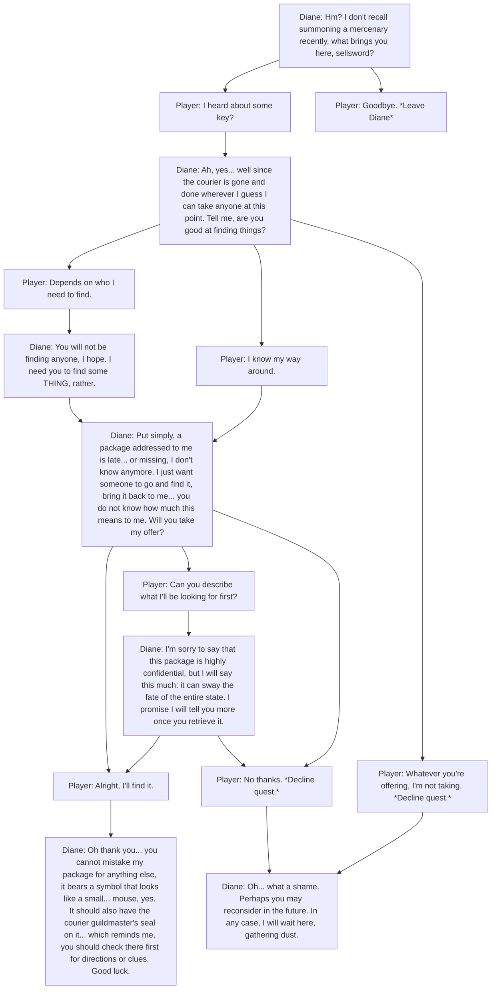

```mermaid
flowchart TD
  STEP1[Diane: Hm? I don't recall summoning a mercenary recently, what brings you here, sellsword?] --> STEP1A[Player: I heard about some key?] & STEP1B[Player: Goodbye. *Leave Diane*]
  STEP1A --> STEP2[Diane: Ah, yes... well since the courier is gone and done wherever I guess I can take anyone at this point. Tell me, are you good at finding things?] --> STEP2A[Player: Depends on who I need to find.] & STEP2B[Player: I know my way around.] & STEP2C[Player: Whatever you're offering, I'm not taking. *Decline quest.*]
  STEP2A --> STEP3A[Diane: You will not be finding anyone, I hope. I need you to find some THING, rather.] --> STEP3B
  STEP2B --> STEP3B[Diane: Put simply, a package addressed to me is late... or missing, I don't know anymore. I just want someone to go and find it, bring it back to me... you do not know how much this means to me. Will you take my offer?] --> STEP4A[Player: Alright, I'll find it.] & STEP4B[Player: Can you describe what I'll be looking for first?] & STEP4C[Player: No thanks. *Decline quest.*]
  STEP4B --> STEP5[Diane: I'm sorry to say that this package is highly confidential, but I will say this much: it can sway the fate of the entire state. I promise I will tell you more once you retrieve it.] --> STEP4A & STEP4C
  STEP2C & STEP4C --> DECLINE[Diane: Oh... what a shame. Perhaps you may reconsider in the future. In any case, I will wait here, gathering dust.]
  STEP4A --> STEPACCEPT[Diane: Oh thank you... you cannot mistake my package for anything else, it bears a symbol that looks like a small... mouse, yes. It should also have the courier guildmaster's seal on it... which reminds me, you should check there first for directions or clues. Good luck.]
```
