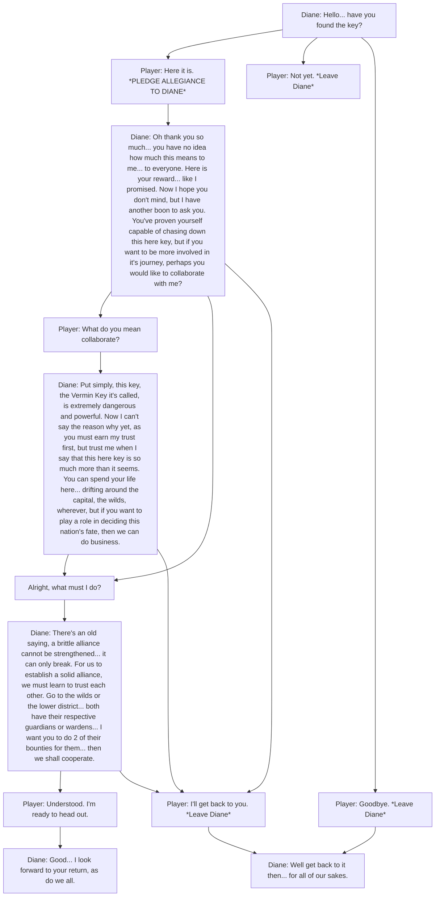

```mermaid
flowchart TD
  STEP1[Diane: Hello... have you found the key?] --> STEP1A[Player: Here it is. *PLEDGE ALLEGIANCE TO DIANE*] & STEP1B[Player: Not yet. *Leave Diane*] & STEP1C[Player: Goodbye. *Leave Diane*]
  STEP1A --> STEP2[Diane: Oh thank you so much... you have no idea how much this means to me... to everyone. Here is your reward... like I promised. Now I hope you don't mind, but I have another boon to ask you. You've proven yourself capable of chasing down this here key, but if you want to be more involved in it's journey, perhaps you would like to collaborate with me?] --> STEP2A[Player: What do you mean collaborate?] & STEP2B[Alright, what must I do?] & STEP2C[Player: I'll get back to you. *Leave Diane*]
  STEP2A --> STEP3A[Diane: Put simply, this key, the Vermin Key it's called, is extremely dangerous and powerful. Now I can't say the reason why yet, as you must earn my trust first, but trust me when I say that this here key is so much more than it seems. You can spend your life here... drifting around the capital, the wilds, wherever, but if you want to play a role in deciding this nation's fate, then we can do business.] --> STEP2B & STEP2C
  STEP2B --> STEP3[Diane: There's an old saying, a brittle alliance cannot be strengthened... it can only break. For us to establish a solid alliance, we must learn to trust each other. Go to the wilds or the lower district... both have their respective guardians or wardens... I want you to do 2 of their bounties for them... then we shall cooperate.] --> STEP4[Player: Understood. I'm ready to head out.] & STEP2C
  STEP4 --> STEP5[Diane: Good... I look forward to your return, as do we all.]
  STEP1C & STEP2C --> GOODBYE[Diane: Well get back to it then... for all of our sakes.]
```
