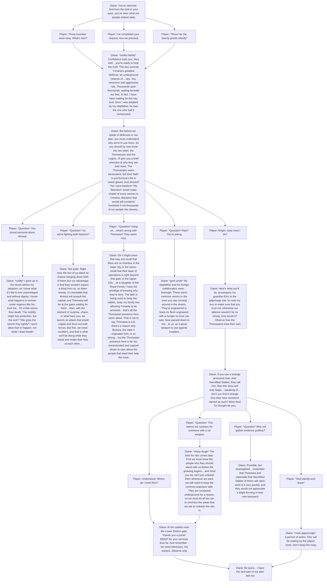

```mermaid
flowchart TD
  STEP2START[Diane: You've returned. And from the look in your eyes, you've seen what our people endure daily.] --> STEP2A[Player: Those bounties were easy. What's next?] & STEP2B[Player: I've completed your request, now we proceed.] & STEP2C[Player: *Show her the bounty proofs silently*]

  STEP2A --> STEP2PLAN[Diane: *smiles faintly* Confidence suits you. Very well... you're ready to hear the truth. This key controls Yrmania's greatest defense: an underground network of... rats. Yes, voracious and aggressive rats. Thousands upon thousands, waiting beneath our feet. In fact, I have been waiting for this key ever since I was adopted by my stepfather, he was the one who had it constructed.]
  STEP2B --> STEP2PLAN
  STEP2C --> STEP2PLAN

  STEP2PLAN --> STEP2CRITIQUE[Diane: But before we speak of defenses or our plan, you must understand why we're to use them. So you should by now know the two sides: the Thomasians and the Legion, I'll give you a brief overview of why they are bad news. The Thomasians seem benevolent, but their 'faith' is just Borisya's fist in velvet gloves. And Ahmed? *her voice hardens* His 'liberation' would make chattel of every woman in Yrmania, liberation that would still condemn hundreds if not thousands of our people into slavery...] --> STEP2Q1[Player: *Question* You sound personal about Ahmed.] & STEP2Q2[Player: *Question* So we're fighting both factions?] & STEP2Q3[Player: *Question* Hang on... what's wrong with Thomasia? They seem nice.] & STEP2Q4[Player: *Question* Rats? You're joking.] & STEP2PROCEED[Player: Alright, what must I do?]

  STEP2Q1 --> STEP2ANSWER1[Diane: *coldly* I grew up in the slums before my adoption, so I know what it's like to live unpriveleged and without dignity. I know what happens to women under regimes like his, trust me... it's a fate worse than death. The nobility might buy protection, but the rest? *She grips the Vermin Key tightly* I won't allow that to happen, not while I draw breath.]
  STEP2Q2 --> STEP2ANSWER2[Diane: Not quite. Right now, the two of us stand no chance bringing down both of them, but our advantage is that they wouldn't expect a thing from us, so listen closely. It's inevitable that Ahmed will assault the capital, and Thomasia will be at the gates waiting for them... then, with the element of surprise, chaos, or what have you, we launch an attack that would cripple and drive out both forces. But first, we need numbers, and that is what we'll be doing while they stand and shake their fists at each other...]
  STEP2Q3 --> STEP2ANSWER3[Diane: Oh it might seem that way, but recall that there are no charities in the lower city or the slums, recall that their base of operations is right beyond that gate, in the Upper City... as a daughter of the Royal Family I have the privilege of knowing why they're here. The faith is being used to sway the nobles, sway my family into allowing Yrmania to be annexed... that's all the Thomasian presence here cares about. That is not to say Thomasia is evil, there's a reason why Borisya, the state it originates from, is so strong... but the Thomasian presence here is far too overextended and capture-driven to care about the people that need their help the most.]
  STEP2Q4 --> STEP2ANSWER4[Diane: *grim smile* My stepfather and his foreign collaborators were... thorough. These aren't common vermin or the ones you see running around in the streets. They're engineered to leave no flesh ungnawed, with a hunger no food can sate. Now passed down to me... to us, as a great weapon to use against invaders.]

  STEP2PROCEED --> STEP2MISSION

   STEP2MISSION[Diane: Here's what you'll do: accompany my guardian Elric to the pilgrimage site, it's now my turn to make sure that you trust me, otherwise our alliance wouldn't be so strong, now would it? Observe how the Thomasians treat their own.] --> STEP2CHOICE[Diane: If you see a strange armoured man, their Sanctified Stalker, they call him, then the show will truly begin... speaking of... don't you find it strange how they have someone named as such? More food for thought for you.]

  STEP2CHOICE --> STEP2C1[Player: Understood. Where do I meet Elric?] & STEP2C2[Player: *Question* Why not gather evidence publicly?] & STEP2C3[Player: *Question* This seems too cautious for someone with a rat weapon.] & STEP2C4[Player: *Nod silently and leave*]

  STEP2C1 --> STEP2END1[Diane: At the stables near the Lower District gate. *Hands you a purse* 650GP for your services thus far. And remember - we need witnesses, not martyrs. Observe only.]
  STEP2C2 --> STEP2END2[Diane: Possible, but shortsighted... remember that Thomasia and especially that Sanctified Stalker of theirs will catch wind of it very quickly, and they would not appreciate a blight forming in their new backyard.]
  STEP2C3 --> STEP2END3[Diane: *sharp laugh* The time for rats comes later. First we must show the people why they should stand with us before the gnawing begins... and mind you we can't just unleash them whenever we want, we still need to keep the common populace safe. They are contained underground for a reason, so we must do all we can to minimize the areas that we are to unleash the rats in.] --> STEP2END1
  STEP2C4 --> STEP2END4[Diane: *nods approvingly* A person of action. Elric will be waiting by the pilgrim tents. Don't keep him long.]

  STEP2END1 --> STEP2FINAL[Diane: Be quick... I have the next part of our plan laid out.]
  STEP2END4 --> STEP2FINAL
```
