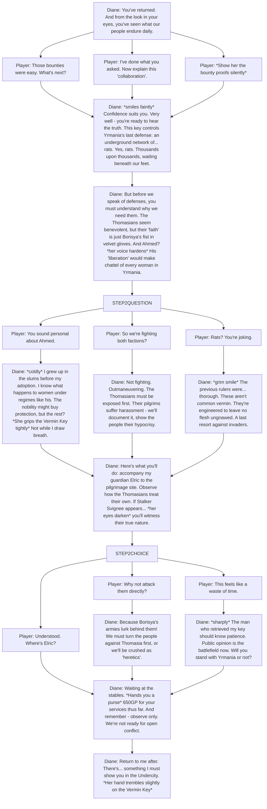

```mermaid
flowchart TD
  STEP2START[Diane: You've returned. And from the look in your eyes, you've seen what our people endure daily.] --> STEP2A[Player: Those bounties were easy. What's next?] & STEP2B[Player: I've done what you asked. Now explain this 'collaboration'.] & STEP2C[Player: *Show her the bounty proofs silently*]

  STEP2A --> STEP2PLAN[Diane: *smiles faintly* Confidence suits you. Very well - you're ready to hear the truth. This key controls Yrmania's last defense: an underground network of... rats. Yes, rats. Thousands upon thousands, waiting beneath our feet.]
  STEP2B --> STEP2PLAN
  STEP2C --> STEP2PLAN

  STEP2PLAN --> STEP2CRITIQUE[Diane: But before we speak of defenses, you must understand why we need them. The Thomasians seem benevolent, but their 'faith' is just Borisya's fist in velvet gloves. And Ahmed? *her voice hardens* His 'liberation' would make chattel of every woman in Yrmania.] --> STEP2QUESTION

  STEP2QUESTION --> STEP2Q1[Player: You sound personal about Ahmed.] & STEP2Q2[Player: So we're fighting both factions?] & STEP2Q3[Player: Rats? You're joking.]

  STEP2Q1 --> STEP2ANSWER1[Diane: *coldly* I grew up in the slums before my adoption. I know what happens to women under regimes like his. The nobility might buy protection, but the rest? *She grips the Vermin Key tightly* Not while I draw breath.]
  STEP2Q2 --> STEP2ANSWER2[Diane: Not fighting. Outmaneuvering. The Thomasians must be exposed first. Their pilgrims suffer harassment - we'll document it, show the people their hypocrisy.]
  STEP2Q3 --> STEP2ANSWER3[Diane: *grim smile* The previous rulers were... thorough. These aren't common vermin. They're engineered to leave no flesh ungnawed. A last resort against invaders.]

  STEP2ANSWER1 --> STEP2MISSION
  STEP2ANSWER2 --> STEP2MISSION
  STEP2ANSWER3 --> STEP2MISSION

  STEP2MISSION[Diane: Here's what you'll do: accompany my guardian Elric to the pilgrimage site. Observe how the Thomasians treat their own. If Stalker Svignee appears... *her eyes darken* you'll witness their true nature.] --> STEP2CHOICE

  STEP2CHOICE --> STEP2C1[Player: Understood. Where's Elric?] & STEP2C2[Player: Why not attack them directly?] & STEP2C3[Player: This feels like a waste of time.]

  STEP2C1 --> STEP2END1[Diane: Waiting at the stables. *Hands you a purse* 650GP for your services thus far. And remember - observe only. We're not ready for open conflict.]
  STEP2C2 --> STEP2END2[Diane: Because Borisya's armies lurk behind them! We must turn the people against Thomasia first, or we'll be crushed as 'heretics'.] --> STEP2END1
  STEP2C3 --> STEP2END3[Diane: *sharply* The man who retrieved my key should know patience. Public opinion is the battlefield now. Will you stand with Yrmania or not?] --> STEP2END1

  STEP2END1 --> STEP2FINAL[Diane: Return to me after. There's... something I must show you in the Undercity. *Her hand trembles slightly on the Vermin Key*]
```
