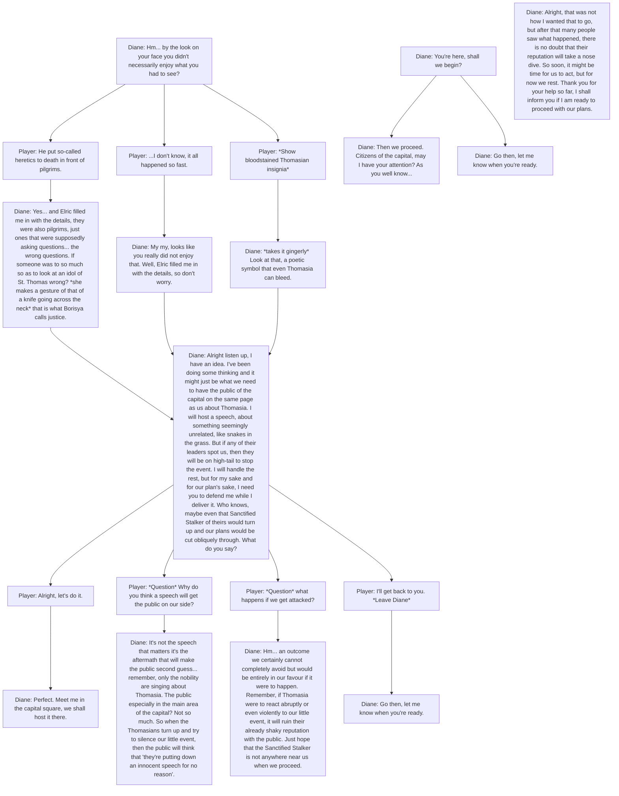

```mermaid
flowchart TD
  AFTERMATH[Diane: Hm... by the look on your face you didn't necessarily enjoy what you had to see?] --> A1[Player: He put so-called heretics to death in front of pilgrims.] & A2[Player: ...I don't know, it all happened so fast.] & A3[Player: *Show bloodstained Thomasian insignia*]

  A1 --> AR1[Diane: Yes... and Elric filled me in with the details, they were also pilgrims, just ones that were supposedly asking questions... the wrong questions. If someone was to so much so as to look at an idol of St. Thomas wrong? *she makes a gesture of that of a knife going across the neck* that is what Borisya calls justice.]
  A2 --> AR2[Diane: My my, looks like you really did not enjoy that. Well, Elric filled me in with the details, so don't worry.] 
  A3 --> AR3[Diane: *takes it gingerly* Look at that, a poetic symbol that even Thomasia can bleed.]

  AR1 --> LEADIN[Diane: Alright listen up, I have an idea. I've been doing some thinking and it might just be what we need to have the public of the capital on the same page as us about Thomasia. I will host a speech, about something seemingly unrelated, like snakes in the grass. But if any of their leaders spot us, then they will be on high-tail to stop the event. I will handle the rest, but for my sake and for our plan's sake, I need you to defend me while I deliver it. Who knows, maybe even that Sanctified Stalker of theirs would turn up and our plans would be cut obliquely through. What do you say?] --> LEADINA[Player: Alright, let's do it.] & LEADINB[Player: *Question* Why do you think a speech will get the public on our side?] & LEADINC[Player: *Question* what happens if we get attacked?] & LEADIND[Player: I'll get back to you. *Leave Diane*]
  LEADINB --> LEADINB1[Diane: It's not the speech that matters it's the aftermath that will make the public second guess... remember, only the nobility are singing about Thomasia. The public especially in the main area of the capital? Not so much. So when the Thomasians turn up and try to silence our little event, then the public will think that 'they're putting down an innocent speech for no reason'.]
  LEADINC --> LEADINC1[Diane: Hm... an outcome we certainly cannot completely avoid but would be entirely in our favour if it were to happen. Remember, if Thomasia were to react abruptly or even violently to our little event, it will ruin their already shaky reputation with the public. Just hope that the Sanctified Stalker is not anywhere near us when we proceed.]
  LEADIND --> LEADIND1[Diane: Go then, let me know when you're ready.]
  LEADINA --> PROCEED[Diane: Perfect. Meet me in the capital square, we shall host it there.]
  AR2 --> LEADIN
  AR3 --> LEADIN

  SPEECH[Diane: You're here, shall we begin?] --> SPEECHA[Player: Let's begin.] & SPEECHB[Player: Actually, hold on... *Leave Diane*]
  SPEECHA[Diane: Then we proceed. Citizens of the capital, may I have your attention? As you well know...]
  SPEECHB[Diane: Go then, let me know when you're ready.]

  POSTRAID[Diane: Alright, that was not how I wanted that to go, but after that many people saw what happened, there is no doubt that their reputation will take a nose dive. So soon, it might be time for us to act, but for now we rest. Thank you for your help so far, I shall inform you if I am ready to proceed with our plans.]
```
