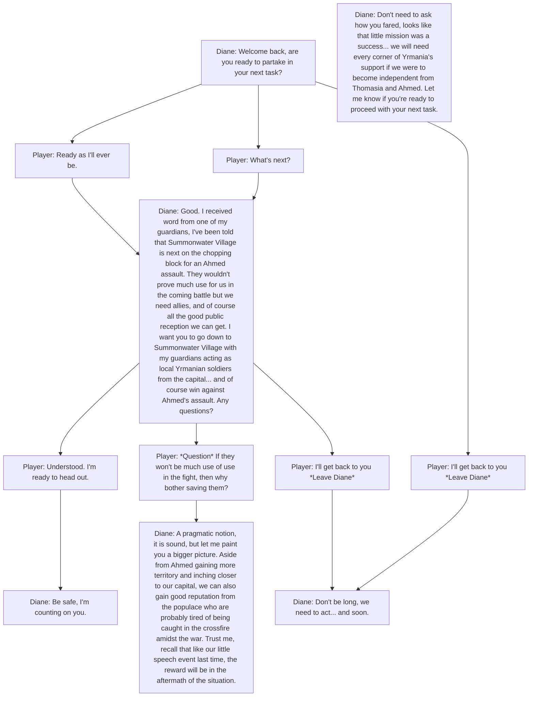

```mermaid
flowchart TD
  INTRO[Diane: Welcome back, are you ready to partake in your next task?] --> INTROA[Player: Ready as I'll ever be.] & INTROB[Player: What's next?] & INTROC[Player: I'll get back to you *Leave Diane*]
  INTROA & INTROB --> INTRO1[Diane: Good. I received word from one of my guardians, I've been told that Summonwater Village is next on the chopping block for an Ahmed assault. They wouldn't prove much use for us in the coming battle but we need allies, and of course all the good public reception we can get. I want you to go down to Summonwater Village with my guardians acting as local Yrmanian soldiers from the capital... and of course win against Ahmed's assault. Any questions?] --> INTRO2A & INTRO2B & INTRO2C
  INTRO2A[Player: Understood. I'm ready to head out.] --> END[Diane: Be safe, I'm counting on you.]
  INTRO2B[Player: *Question* If they won't be much use of use in the fight, then why bother saving them?] --> INTRO2BANS[Diane: A pragmatic notion, it is sound, but let me paint you a bigger picture. Aside from Ahmed gaining more territory and inching closer to our capital, we can also gain good reputation from the populace who are probably tired of being caught in the crossfire amidst the war. Trust me, recall that like our little speech event last time, the reward will be in the aftermath of the situation.]
  INTRO2C[Player: I'll get back to you *Leave Diane*]

  INTROC --> GOODBYE[Diane: Don't be long, we need to act... and soon.]
  INTRO2C --> GOODBYE
  
  AFTERMATH[Diane: Don't need to ask how you fared, looks like that little mission was a success... we will need every corner of Yrmania's support if we were to become independent from Thomasia and Ahmed. Let me know if you're ready to proceed with your next task.]
```
