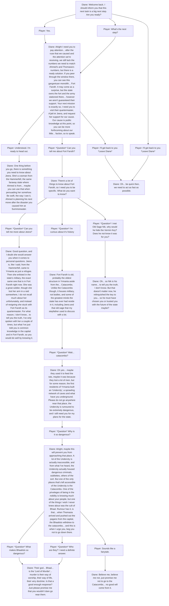

```mermaid
flowchart TD
  INTRO[Diane: Welcome back. I should inform you that this next task is a big next step. Are you ready?] --> INTROA[Player: Yes.] & INTROB[Player: What's the next step?] & INTROC[Player: I'll get back to you *Leave Diane*]
  INTROA & INTROB --> INTRO1[Diane: Alright I need you to pay attention... after the ruse that we caused and the attention we're receiving, we still lack the numbers we need to match Ahmed's and Thomasia's numbers, but there is a ready solution. If you peer through the window there, you can see this gargantuan monolith... Fort Faroth. It may come as a surprise, but the state owns the fort and the army stationed there... however we aren't guaranteed their support. Your next mission is exactly so, I need you to visit their quartermaster, A'jak'nir Jeera, and request her support for our cause. Our cause is public knowledge at this point, so you can be more forthcoming about our little... faction, so to speak.] --> INTRO2A & INTRO2B & INTRO2C
  INTRO2A[Player: Understood. I'm ready to head out.] --> END[Diane: One thing before you go, there is something you need to know about Jeera. She's a woman from the Hammerfell, the same faraway state where Ahmed is from... maybe you can use that when persuading her somehow. Be swift, the way I see it, Ahmed is planning his next move after the disaster you caused him at Summonwater.]
  INTRO2B[Player: *Question* Can you tell me about Fort Faroth?] --> INTRO2BANS[Diane: There's a lot of things to know about Fort Faroth, so I need you to be specific. What do you want to know?] --> INTRO2BQA[Player: *Question* Can you tell me more about Jeera?] & INTRO2BQB[Player: *Question* I'm curious about it's history] & INTRO2BQC[Player: *Question* I met Old Sage Nik, why would he hide the Vermin Key? Does he not know it was for you?]
  INTRO2BQA --> INTRO2BQAANS[Diane: Good question, and I doubt she would answer you when it comes to personal questions. Jeera is, like I said, from the Hammerfell, came to Yrmania as just a refugee. Then she enlisted in the state's military, the exact same one that is in Fort Faroth right now. She was a great soldier, though she lost her arm in a raid somewhere, I do not recall much about her unfortunately, and instead of resigning she stuck with Fort Faroth as its quartermaster. For what reason, I don't know... to tell you the truth, I've only spoken with her a couple of times, but what I've just told you is common knowledge in the capital and in Fort Faroth, so you would do well by knowing it.]
  INTRO2BQB --> INTRO2BQBANS[Diane: Fort Faroth is old, probably the oldest structure in Yrmania aside from the... Catacombs. Unlike the Catacombs though, it houses military, not bodies, and some of the greatest minds the state has ever had reside in it, including Jeera and that old sage that my stepfather used to discuss with a lot.] --> INTRO2BQFOLLOWUP[Player: *Question* Wait... catacombs?] --> INTRO2BQFOLLOWUPANS[Diane: Oh yes... maybe they used it to feed the rats, maybe it was because they lost a lot of men, but for some reason, the first residents of Yrmania built an 'Undercity', a sprawling network of caves and what have you underground. Please do not go anywhere near that place, the Undercity is rumoured to be extremely dangerous, and I still need you for my plans for the state.] --> INTRO2BQFOLLOWUP2[Player: *Question* Why is it so dangerous?] --> INTRO2BQANS[Diane: Alright, maybe this will prevent you from approaching that place. A lot of the Undercity is actually inaccessible, and from what I've heard, the Undercity actually housed dangerous criminals, oubliettes, others of the sort. But one of the only places that's left accessible of the Undercity is the Catacombs. One of the priveleges of being in the nobility is knowing much about your people, but one of the things I wish I never knew about was the cult of Bhaal. Rumour has it, is that... when Thomasia arrived and pushed out the pagans from the capital, the Bhaalists withdrew to the catacombs... and this is when I urge you, beg you not to go down there.] --> INTRO2B1A[Player: *Question* What makes Bhaalists so dangerous?] & INTRO2B1B[Player: *Question* Who are they? I need a definite answer.] & INTRO2B1C[Player: Sounds like a fairytale.]
  INTRO2B1A --> INTRO2B1ABRESPONSE[Diane: Their god... Bhaal... is the 'Lord of Murder'... murder is their way of worship, their way of life, their very doctrine. Is that a good enough response? Just please promise me that you wouldn't dare go near them.]
  INTRO2B1B --> INTRO2B1ABRESPONSE
  INTRO2B1C --> INTRO2B1CRESPONSE[Diane: Believe me, believe me not, just promise me not to go to the Catacombs... no good will come from it.]
  INTRO2BQC --> INTRO2BQCANS[Diane: Oh... so Nik is his name... to tell you the truth, I don't know. But that doesn't matter now, he relinquished the key to you... so he must have chosen you or trusted you with the future of the state maybe?]
  INTRO2C[Player: I'll get back to you *Leave Diane*]

  INTROC --> INTROGOODBYE[Diane: Oh... be quick then, we need to act as fast as possible.]
  INTRO2C --> INTROGOODBYE
  
```
