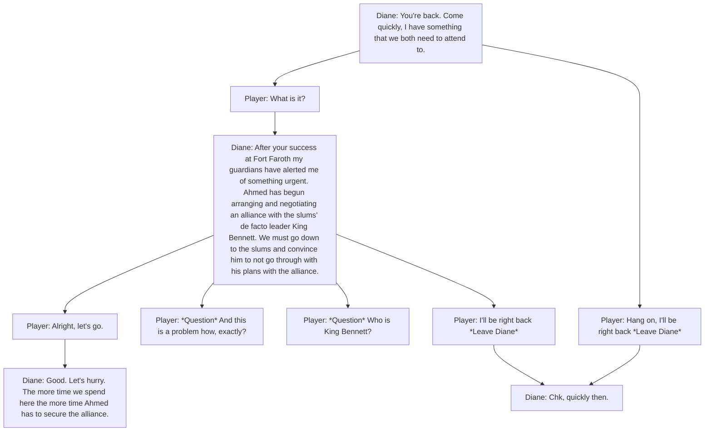

```mermaid
flowchart TD
  INTRO[Diane: You're back. Come quickly, I have something that we both need to attend to.] --> INTROA[Player: What is it?] & INTROB[Player: Hang on, I'll be right back *Leave Diane*]
  INTROA --> INTRO2[Diane: After your success at Fort Faroth my guardians have alerted me of something urgent. Ahmed has begun arranging and negotiating an alliance with the slums' de facto leader King Bennett. We must go down to the slums and convince him to not go through with his plans with the alliance.] --> INTRO2A[Player: Alright, let's go.] & INTRO2B[Player: *Question* And this is a problem how, exactly?] & INTRO2C[Player: *Question* Who is King Bennett?] & INTRO2D[Player: I'll be right back *Leave Diane*]
  INTRO2A --> INTRO3[Diane: Good. Let's hurry. The more time we spend here the more time Ahmed has to secure the alliance.]

  INTROB & INTRO2D --> GOODBYE[Diane: Chk, quickly then.]
  
```
