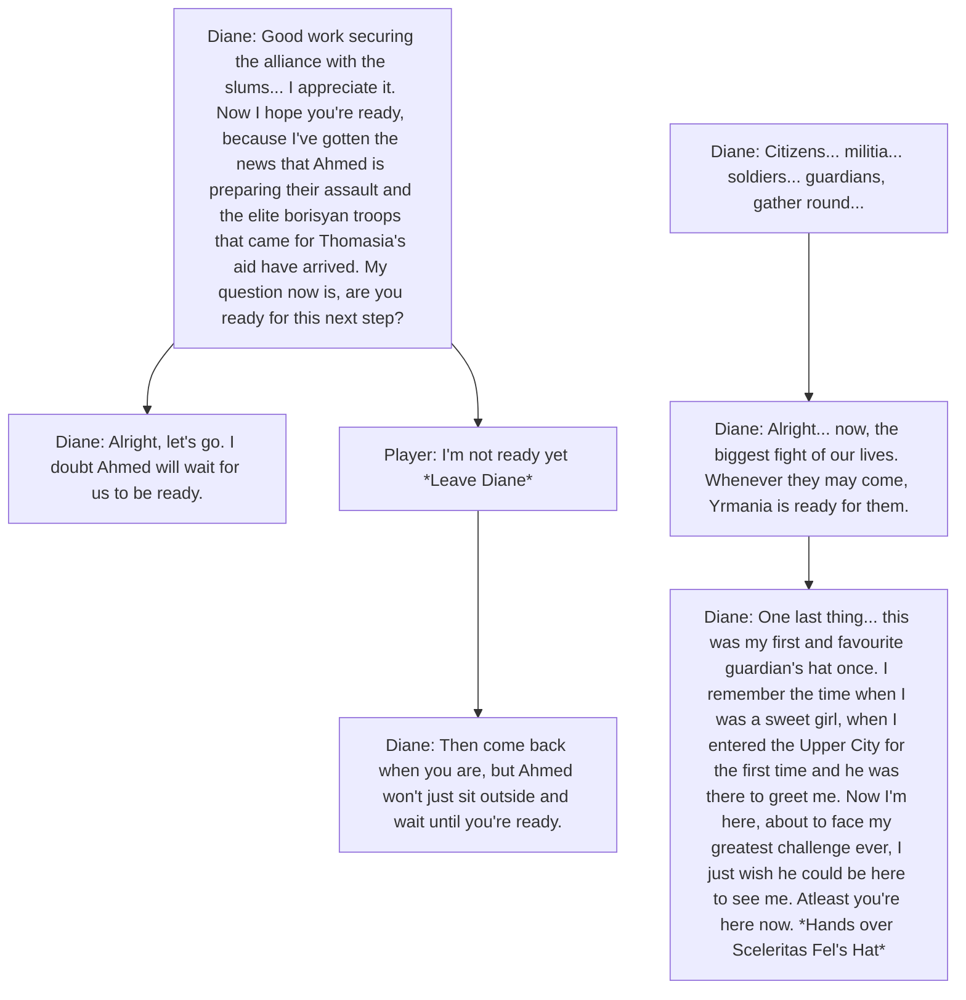

```mermaid
flowchart TD
  BENNETTAFTERMATH[Diane: Good work securing the alliance with the slums... I appreciate it. Now I hope you're ready, because I've gotten the news that Ahmed is preparing their assault and the elite borisyan troops that came for Thomasia's aid have arrived. My question now is, are you ready for this next step?] --> AFTERMATHA[Player: I'm ready. *START PRE-FINALE AND AHMED ASSAULT*] & AFTERMATHB[Player: I'm not ready yet *Leave Diane*]
  AFTERMATHA[Diane: Alright, let's go. I doubt Ahmed will wait for us to be ready.]
  AFTERMATHB --> GOODBYE[Diane: Then come back when you are, but Ahmed won't just sit outside and wait until you're ready.]

  PREFINALE[Diane: Citizens... militia... soldiers... guardians, gather round...] --> PREFINALE2[Diane: Alright... now, the biggest fight of our lives. Whenever they may come, Yrmania is ready for them.] --> PREFINALE3[Diane: One last thing... this was my first and favourite guardian's hat once. I remember the time when I was a sweet girl, when I entered the Upper City for the first time and he was there to greet me. Now I'm here, about to face my greatest challenge ever, I just wish he could be here to see me. Atleast you're here now. *Hands over Sceleritas Fel's Hat*]
```
