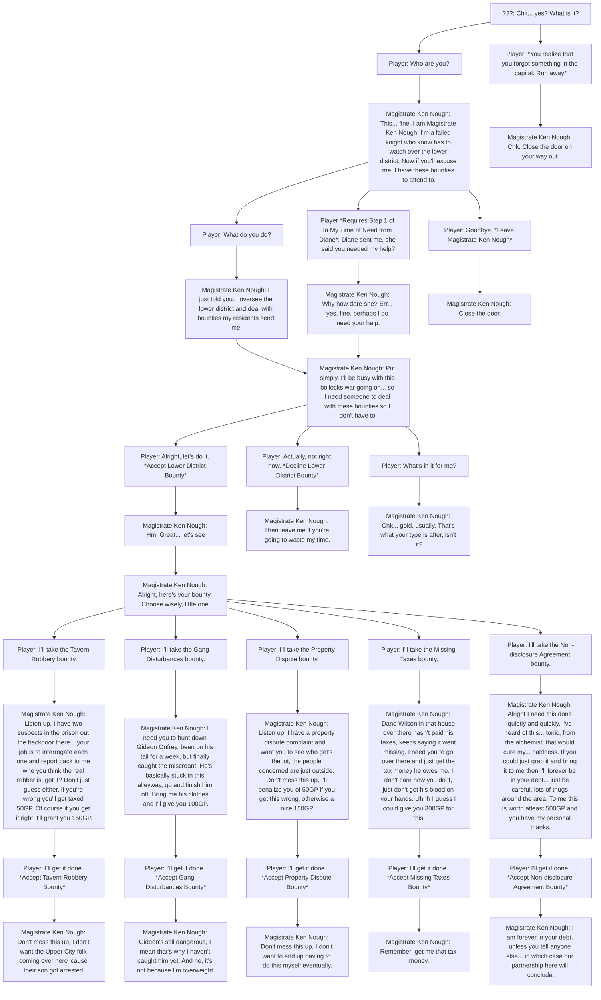

```mermaid
flowchart TD
    A[???: Chk... yes? What is it?] --> B[Player: Who are you?]
    A --> D[Player: *You realize that you forgot something in the capital. Run away*]

    B --> E[Magistrate Ken Nough: This... fine. I am Magistrate Ken Nough, I'm a failed knight who know has to watch over the lower district. Now if you'll excuse me, I have these bounties to attend to.]
    E --> F[Player: What do you do?]
    E --> G[Player *Requires Step 1 of In My Time of Need from Diane*: Diane sent me, she said you needed my help?]
    E --> H[Player: Goodbye. *Leave Magistrate Ken Nough*]

    F --> I[Magistrate Ken Nough: I just told you. I oversee the lower district and deal with bounties my residents send me.]
    G --> T[Magistrate Ken Nough: Why how dare she? Err... yes, fine, perhaps I do need your help.]
    H --> K[Magistrate Ken Nough: Close the door.]

    I & T --> L[Magistrate Ken Nough: Put simply, I'll be busy with this bollocks war going on... so I need someone to deal with these bounties so I don't have to.]
    L --> M[Player: Alright, let's do it. *Accept Lower District Bounty*]
    L --> N[Player: Actually, not right now. *Decline Lower District Bounty*]
    L --> O[Player: What's in it for me?]

    M --> P[Magistrate Ken Nough: Hm. Great... let's see]
    N --> Q[Magistrate Ken Nough: Then leave me if you're going to waste my time.]
    O --> R[Magistrate Ken Nough: Chk... gold, usually. That's what your type is after, isn't it?]

    D --> S[Magistrate Ken Nough: Chk. Close the door on your way out.]

    P --> U[Magistrate Ken Nough: Alright, here's your bounty. Choose wisely, little one.]
    U --> V1[Player: I'll take the Tavern Robbery bounty.]
    U --> V2[Player: I'll take the Gang Disturbances bounty.]
    U --> V3[Player: I'll take the Property Dispute bounty.]
    U --> V4[Player: I'll take the Missing Taxes bounty.]
    U --> V5[Player: I'll take the Non-disclosure Agreement bounty.]

    V1 --> W1[Magistrate Ken Nough: Listen up, I have two suspects in the prison out the backdoor there... your job is to interrogate each one and report back to me who you think the real robber is, got it? Don't just guess either, if you're wrong you'll get taxed 50GP. Of course if you get it right, I'll grant you 150GP.]
    V2 --> W2[Magistrate Ken Nough: I need you to hunt down Gideon Onfrey, been on his tail for a week, but finally caught the miscreant. He's basically stuck in this alleyway, go and finish him off. Bring me his clothes and I'll give you 100GP.]
    V3 --> W3[Magistrate Ken Nough: Listen up, I have a property dispute complaint and I want you to see who get's the lot, the people concerned are just outside. Don't mess this up, I'll penalize you of 50GP if you get this wrong, otherwise a nice 150GP.]
    V4 --> W4[Magistrate Ken Nough: Dane Wilson in that house over there hasn't paid his taxes, keeps saying it went missing. I need you to go over there and just get the tax money he owes me. I don't care how you do it, just don't get his blood on your hands. Uhhh I guess I could give you 300GP for this.]
    V5 --> W5[Magistrate Ken Nough: Alright I need this done quietly and quickly. I've heard of this... tonic, from the alchemist, that would cure my... baldness. If you could just grab it and bring it to me then I'll forever be in your debt... just be careful, lots of thugs around the area. To me this is worth atleast 500GP and you have my personal thanks.]

    W1 --> X1[Player: I'll get it done. *Accept Tavern Robbery Bounty*]
    W2 --> X2[Player: I'll get it done. *Accept Gang Disturbances Bounty*]
    W3 --> X3[Player: I'll get it done. *Accept Property Dispute Bounty*]
    W4 --> X4[Player: I'll get it done. *Accept Missing Taxes Bounty*]
    W5 --> X5[Player: I'll get it done. *Accept Non-disclosure Agreement Bounty*]

    X1 --> Y1[Magistrate Ken Nough: Don't mess this up, I don't want the Upper City folk coming over here 'cause their son got arrested.]
    X2 --> Y2[Magistrate Ken Nough: Gideon's still dangerous, I mean that's why I haven't caught him yet. And no, it's not because I'm overweight.]
    X3 --> Y3[Magistrate Ken Nough: Don't mess this up, I don't want to end up having to do this myself eventually.]
    X4 --> Y4[Magistrate Ken Nough: Remember: get me that tax money.]
    X5 --> Y5[Magistrate Ken Nough: I am forever in your debt, unless you tell anyone else... in which case our partnership here will conclude.]
```
