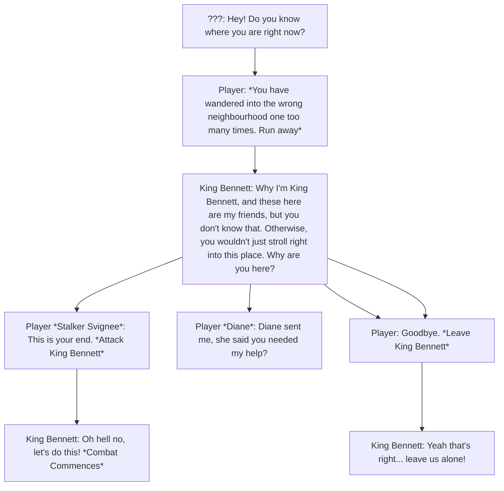

```mermaid
flowchart TD
    A[???: Hey! Do you know where you are right now?]
    A --> B[Player: *You have wandered into the wrong neighbourhood one too many times. Run away*]

    B --> E[King Bennett: Why I'm King Bennett, and these here are my friends, but you don't know that. Otherwise, you wouldn't just stroll right into this place. Why are you here?]
    E --> F1[Player *Stalker Svignee*: This is your end. *Attack King Bennett*]
    E --> F2[Player *Diane*: Diane sent me, she said you needed my help?]
    E --> F3[Player *Ahmed*: Hail! I am here with prophet Ahmed, here to discuss our alliance.]
    E --> F3[Player: Goodbye. *Leave King Bennett*]

    F1 --->G1[King Bennett: Oh hell no, let's do this! *Combat Commences*]
    F3 --->G4[King Bennett: Yeah that's right... leave us alone!]

```
