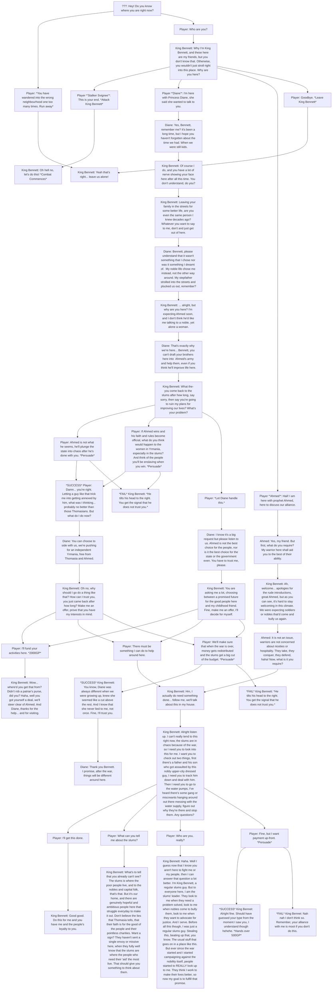

```mermaid
flowchart TD
    A[???: Hey! Do you know where you are right now?]
    A --> B[Player: *You have wandered into the wrong neighbourhood one too many times. Run away*] & C[Player: Who are you?]
    C --> E[King Bennett: Why I'm King Bennett, and these here are my friends, but you don't know that. Otherwise, you wouldn't just stroll right into this place. Why are you here?]
    E --> SVI1[Player *'Stalker Svignee'*: This is your end. *Attack King Bennett*]
    E --> DIA1[Player *'Diane'*: I'm here with Princess Diane, she said she wanted to talk to you.]
    E --> AHM1[Player *'Ahmed'*: Hail! I am here with prophet Ahmed, here to discuss our alliance.]
    E --> F4[Player: Goodbye. *Leave King Bennett*]

    SVI1 ---> G1[King Bennett: Oh hell no, let's do this! *Combat Commences*]
    F4 & B --->G4[King Bennett: Yeah that's right... leave us alone!]

    AHM1 --> AHM2[Ahmed: Yes, my friend. But first, what do you require? My warrior here shall aid you to the best of their ability.]
    AHM2 --> AHM3[King Bennett: Ah, welcome... apologies for the rude introductions, great Ahmed, but as you can see, it's hard to stay welcoming in this climate. We were expecting soldiers or nobles that'd come and bully us again.]
    AHM3 --> AHM4[Ahmed: It is not an issue, warriors are not concerned about niceties or hospitality. They take, they conquer, they defend, haha! Now, what is it you require?]
    AHM4 --> KING1[King Bennett: Hm, I actually do need something done... follow me, we'll talk about this in my house.]

    DIA1 --> DIA2[Diane: Yes, Bennett, remember me? It's been a long time, but I hope you haven't forgotten about the time we had. When we were still kids.]
    DIA2 --> DIA3[King Bennett: Of course I do, and you have a lot of nerve showing your face here after all this time. You don't understand, do you?]
    DIA3 --> DIA4[King Bennett: Leaving your family in the streets for some better life, are you even the same person I knew decades ago? Whatever you want to say to me, don't and just get out of here.]
    DIA4 --> DIA5[Diane: Bennett, please understand that it wasn't something that I chose nor was it something I dreamt of.  My noble life chose me instead, not the other way around. My stepfather strolled into the streets and plucked us out, remember?]
    DIA5 --> DIA6[King Bennett: ... alright, but why are you here? I'm expecting Ahmed soon, and I don't think he'd like me talking to a noble, yet alone a woman.]
    DIA6 --> DIA7[Diane: That's exactly why we're here... Bennett, you can't draft your brothers here into  Ahmed's army and help them, even if you think he'll improve life here.]
    DIA7 --> DIA8[King Bennett: What the- you come back to the slums after how long, say sorry, then say you're going to ruin my plans for improving our lives? What's your problem?]
    DIA8 --> DIA9A[Player: Ahmed is not what he seems, he'll plunge the state into chaos after he's done with you. *Persuade*] & DIA9B[Player: If Ahmed wins and his faith and rules become official, what do you think would happen to the women in Yrmania, especially in the slums? And think of the people you'll be enslaving when you win. *Persuade*] & DIA9C[Player: *Let Diane handle this.*]
    DIA9A & DIA9B --> DIA9ASUC[*SUCCESS* Player: Damn... you're right. Letting a guy like that trick me into getting annexed by him, what was I thinking... probably no better than those Thomasians. But what do I do now?] --> DIA9ASUC1[Diane: You can choose to side with us, we're pushing for an independent Yrmania, free from Thomasia and Ahmed.] --> DIA9ASUC2[King Bennett: Oh no, why should I go do a thing like that? How can I trust you, you just came back after how long? Make me an offer, prove that you have my interests in mind.] --> DIA9C3A & DIA9C3B & DIA9C3C
    DIA9A & DIA9B --> DIA9AFAI[*FAIL* King Bennett: *He tilts his head to the right. You get the signal that he does not trust you.*]
    DIA9C --> DIA9C1[Diane: I know it's a big request but please listen to us. Ahmed is not the best choice for the people, nor is it the best choice for the state or the government even. You have to trust me, please.]
    DIA9C1 --> DIA9C2[King Bennett: You are asking me a lot, choosing between a promised future for the good people here and my childhood friend. Fine, make me an offer, I'll decide for myself.]
    DIA9C2 --> DIA9C3A[Player: I'll fund your activities here. *2000GP*] & DIA9C3B[Player: There must be something I can do to help around here.] & DIA9C3C[Player: We'll make sure that when the war is over, money gets redistributed and the slums get a big cut of the budget. *Persuade*]
    DIA9C3B --> KING1
    DIA9C3A --> KDA[King Bennett: Wow... where'd you get that from? Didn't rob a patriar's purse, did you? Haha, well you got yourself a deal, we'll steer clear of Ahmed. And Diane, thanks for the help... and for visiting.]
    DIA9C3C --> KDCSUC1[*SUCCESS* King Bennett: You know, Diane was always different when we were growing up, knew she seemed like a cut above the rest. And I know that she never lied to me, not once. Fine, I'll trust you.] & KDCFAI1[*FAIL* King Bennett: *He tilts his head to the right. You get the signal that he does not trust you.*]
    KDCSUC1 --> KDC2[Diane: Thank you Bennett. I promise, after the war, things will be different around here.]

    KING1 --> KING2[King Bennett: Alright listen up. I can't really tend to this right now, the slums are in chaos because of the war, so I need you to look into this for me. I want you to check out two things, first there's a father and his son who got assaulted by this nobly upper-city dressed guy, I need you to track him down and deal with him. Then I need you to go to the water pumps, I've heard there's some gang or miscreants hanging around out there messing with the water supply, figure out why they're there and stop them. Any questions?]
    KING2 --> KING3A[Player: I'll get this done.] & KING3B[Player: What can you tell me about the slums?] & KING3C[Player: Who are you, really?] & KING3D[Player: Fine, but I want payment up-front. *Persuade*]
    KING3A --> KING4[King Bennett: Good good. Do this for me and you have me and the people's loyalty to you.]
    KING3B --> KING3BANS[King Bennett: What's to tell that you already can't see? The slums is where the poor people live, and to the nobles and capital folk, that's that. But it's our home, and there are genuinely hopeful and ambitious people here that struggle everyday to make it out. Don't believe the lies that Thomasia tells, that their faith is for the good of the people and their pointless charities. Want a sign? They haven't sent a single envoy or missive here, when they fully well know that the slums are where the people who need their 'aid' the most live. That should give you something to think about them.]
    KING3C --> KING3CANS[King Bennett: Haha. Well I guess now that I know you aren't here to fight me or my people, then I can answer that question a lot better. I'm King Bennett, a regular slums guy. But to everyone here, I am the slums' leader. They look to me when they need a problem solved, look to me when nobles come to bully them, look to me when they want to advocate for justice. And I serve. Before all this though, I was just a regular slums guy. Stealing this, beating up that, you know. The usual stuff that goes on in a place like this. But ever since the war started and I started campaigning against the nobility itself, people started to REALLY look up to me. They think I work to make their lives better, so now my goal is to fulfill that promise.]
    KING3D --> KING3DSUC[*SUCCESS* King Bennet: Alright fine. Should have guessed your type from the moment I saw you, I understand though hehehe. *Hands over 500GP*]
    KING3D --> KING3DFAI[*FAIL* King Bennet: Nah nah I don't think so. Remember, your alliance with me is moot if you don't do this.]
```
