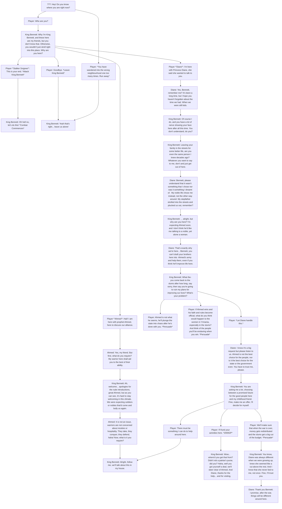

```mermaid
flowchart TD
    A[???: Hey! Do you know where you are right now?]
    A --> B[Player: *You have wandered into the wrong neighbourhood one too many times. Run away*] & C[Player: Who are you?]
    C --> E[King Bennett: Why I'm King Bennett, and these here are my friends, but you don't know that. Otherwise, you wouldn't just stroll right into this place. Why are you here?]
    E --> SVI1[Player *'Stalker Svignee'*: This is your end. *Attack King Bennett*]
    E --> DIA1[Player *'Diane'*: I'm here with Princess Diane, she said she wanted to talk to you.]
    E --> AHM1[Player *'Ahmed'*: Hail! I am here with prophet Ahmed, here to discuss our alliance.]
    E --> F4[Player: Goodbye. *Leave King Bennett*]

    SVI1 ---> G1[King Bennett: Oh hell no, let's do this! *Combat Commences*]
    F4 & B --->G4[King Bennett: Yeah that's right... leave us alone!]

    AHM1 --> AHM2[Ahmed: Yes, my friend. But first, what do you require? My warrior here shall aid you to the best of their ability.]
    AHM2 --> AHM3[King Bennett: Ah, welcome... apologies for the rude introductions, great Ahmed, but as you can see, it's hard to stay welcoming in this climate. We were expecting soldiers or nobles that'd come and bully us again.]
    AHM3 --> AHM4[Ahmed: It is not an issue, warriors are not concerned about niceties or hospitality. They take, they conquer, they defend, haha! Now, what is it you require?]
    AHM4 --> KING1[King Bennett: Alright, follow me, we'll talk about this in my house.]

    DIA1 --> DIA2[Diane: Yes, Bennett, remember me? It's been a long time, but I hope you haven't forgotten about the time we had. When we were still kids.]
    DIA2 --> DIA3[King Bennett: Of course I do, and you have a lot of nerve showing your face here after all this time. You don't understand, do you?]
    DIA3 --> DIA4[King Bennett: Leaving your family in the streets for some better life, are you even the same person I knew decades ago? Whatever you want to say to me, don't and just get out of here.]
    DIA4 --> DIA5[Diane: Bennett, please understand that it wasn't something that I chose nor was it something I dreamt of.  My noble life chose me instead, not the other way around. My stepfather strolled into the streets and plucked us out, remember?]
    DIA5 --> DIA6[King Bennett: ... alright, but why are you here? I'm expecting Ahmed soon, and I don't think he'd like me talking to a noble, yet alone a woman.]
    DIA6 --> DIA7[Diane: That's exactly why we're here... Bennett, you can't draft your brothers here into  Ahmed's army and help them, even if you think he'll improve life here.]
    DIA7 --> DIA8[King Bennett: What the- you come back to the slums after how long, say sorry, then say you're going to ruin my plans for improving our lives? What's your problem?]
    DIA8 --> DIA9A[Player: Ahmed is not what he seems, he'll plunge the state into chaos after he's done with you. *Persuade*] & DIA9B[Player: If Ahmed wins and his faith and rules become official, what do you think would happen to the women in Yrmania, especially in the slums? And think of the people you'll be enslaving when you win. *Persuade*] & DIA9C[Player: *Let Diane handle this.*]
    DIA9C --> DIA9C1[Diane: I know it's a big request but please listen to us. Ahmed is not the best choice for the people, nor is it the best choice for the state or the government even. You have to trust me, please.]
    DIA9C1 --> DIA9C2[King Bennett: You are asking me a lot, choosing between a promised future for the good people here and my childhood friend. Fine, make me an offer, I'll decide for myself.]
    DIA9C2 --> DIA9C3A[Player: I'll fund your activities here. *2000GP*] & DIA9C3B[Player: There must be something I can do to help around here.] & DIA9C3C[Player: We'll make sure that when the war is over, money gets redistributed and the slums get a big cut of the budget. *Persuade*]
    DIA9C3B --> KING1
    DIA9C3A --> KDA[King Bennett: Wow... where'd you get that from? Didn't rob a patriar's purse, did you? Haha, well you got yourself a deal, we'll steer clear of Ahmed. And Diane, thanks for the help... and for visiting.]
    DIA9C3C --> KDC1[King Bennett: You know, Diane was always different when we were growing up, knew she seemed like a cut above the rest. And I know that she never lied to me, not once. Fine, I'll trust you.]
    KDC1 --> KDC2[Diane: Thank you Bennett. I promise, after the war, things will be different around here.]

```
