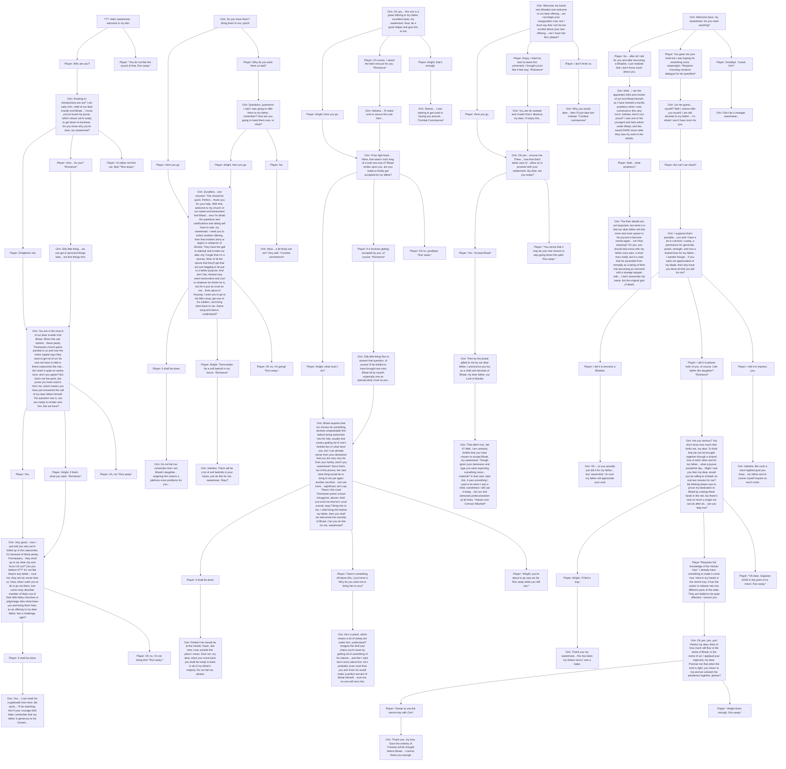

```mermaid
flowchart TD
  ORININTRO0[???: Hello sweetmeat... welcome to my den.] --> ORININTRO0A[Player: Who are you?] & ORININTRO0B[Player: *You do not like the sound of that. Run away.*]
  ORININTRO0A --> ORININTRO1[Orin: Rushing to introductions are we? I am Lady Orin, child of our dear murder lord Bhaal... I know you've found my prose, which means we're ready to get down to business. Do you know why you're here, my sweetmeat?]
  ORININTRO1 --> ORININTRO2A[Player: Enlightnen me.] & ORININTRO2B[Player: Uhm... for you? *Romance*] & ORININTRO2C[Player: I'd rather not find out. Bye! *Run away.*]
  ORININTRO2A --> ORININTRO2A1[Orin: You are in the church of our dear murder lord Bhaal. When this war started... these pesky Thomasian church goers pointed to us and now the entire capital says they want to get rid of us! So now we have to hide in these catacombs like rats... the smell is quite an earthy tone, don't you agree? But that's not the point, the prose you have read is from me, which means you have just answered the call of my dear father himself. The question now is, are you ready to render unto him, like we have?] --> ORININTRO3A & ORININTRO3B & ORININTRO3C
  ORININTRO2B --> ORININTRO2B1[Orin: Silly little thing... we can get to personal things later... but first things first.] --> ORININTRO2A1
  ORININTRO3A[Player: Yes.] --> ORININTRO4
  ORININTRO3B[Player: Alright, if that's what you want. *Romance*] --> ORININTRO4
  ORININTRO3C[Player: Uh, no! *Run away*]
  ORININTRO4[Orin: Very good... now I just told you why we're holed up in the catacombs, it's because of these pesky Thomasians... they stroll up to our dear city and force US out? Can you believe it??? It's not like they're any better... trust me, they are far worse than us. Now, what I want you to do is go out there, lure some stray obsolete member of theirs out of their little hidey churches or pilgrimage sites what-have-you and bring them here, as an offering to my dear father. Not a challenge, right?] --> ORININTRO4A & ORININTRO4B
  ORININTRO4A[Player: It shall be done.] --> ORININTRO5
  ORININTRO4B[Player: Oh no, I'm not doing this! *Run away.*]
  ORININTRO5[Orin: Yes... I can smell his cryptbreath from here. Be quick... I'll be watching. And if your courage doth falter, remember that my father is generous to his chosen...]

  THOMASIAN0[Orin: Do you have them? Bring them to me, quick!] --> THOMASIAN0A & THOMASIAN0B
  THOMASIAN0A[Player: Here you go.] --> THOMASIAN1
  THOMASIAN0B[Player: Why do you want them so bad?] --> THOMASIAN0B1[Orin: Questions, questions! I said I was going to offer them to my father, remember? Now are you going to hand them over, or what?] --> THOMASIAN1A & THOMASIAN1B
  THOMASIAN1A[Player: Alright, here you go.] --> THOMASIAN1
  THOMASIAN1B[Player: No.] --> THOMASIAN1B1[Orin: Wow... a bit feisty are we? Very well. *Combat commences*]
  THOMASIAN1[Orin: Excellent... one moment. This should be quick. Perfect... thank you for your help. With that, welcome to my church of our sweet and benevolent lord Bhaal... now I'm afraid the questions and clarifications and dating will have to wait, my sweetmeat. I need you to collect another offering, from that insolent army or legion or whatever of Ahmed. They have the gall to attempt and invade our dear city. Forget that I'm a woman, think of all the slaves that they'll get that are just begging to be put to a better purpose. And don't fret, Ahmed may seem benevolent and cool or whatever he thinks he is, but he is just as cruel as me... think about it! Anyway, I want you to go to his little camp, get one of his soldiers, and bring them back to me. Same song and dance, understand?] --> THOMASIAN2A & THOMASIAN2B & THOMASIAN2C
  THOMASIAN2A[Player: It shall be done.] --> THOMASIAN2A1[Orin: Do not fail me, remember that I am Bhaal's daughter... angering him means a plethora more problems for you...]
  THOMASIAN2B[Player: Alright. There better be a soft bedroll in my future. *Romance*]  --> THOMASIAN2B1[Orin: Hahaha. There will be a lot of soft bedrolls in your future, just do this for me, sweetmeat. Okay?]
  THOMASIAN2C[Player: Oh no, I'm going! *Run away.*]

  AHMED0[Orin: Oh yes... this one is a great offering to my father, excellent taste, my sweetmeat. Now, be a good helper and give him to me.] --> AHMED0A & AHMED0B & AHMED0C
  AHMED0C[Player: Alright, that's enough.] --> AHMEDC1[Orin: Shame... I was starting to get used to having you around... *Combat Commences*]
  AHMED0A[Player: Alright, here you go.] --> AHMED1
  AHMED0B[Player: Of course, I saved the best one just for you. *Romance*] --> AHMED0B1[Orin: Hahaha... I'll make sure to savour this one then...] --> AHMED1[Orin: I'll be right back... there, that wasn't such long of a wait now was it? Bhaal smiles upon you, are you ready to finally get accepted by my father?]
  AHMED1 --> AHMED2A & AHMED2B & AHMED2C[Player: Oh no, goodbye! *Run away.*]
  AHMED2A[Player: Alright, what must I do?] --> AHMED3
  AHMED2B[Player: If it involves getting accepted by you, of course. *Romance*] --> AHMED2B0[Orin: Silly little thing! But to answer that question, of course I'll be thrilled to have brought one unto Bhaal all by myself, especially one as spectacularly cruel as you...] --> AHMED3
  AHMED3[Orin: Bhaal requires that his chosen do something divinely unspeakable first before being welcomed into his fold, usually that means getting rid of one's familial ties or what have you, but I can already sense from your demeanor that you are very very far from your family, aren't you sweetmeat? Since that's out of the picture, the next best thing would be to bring to me yet again another sacrifice... but one more... significant, let's say. There's this cruel Thomasian priest, known misogynist, abuser, thief, just trust me that he's cruel overall, okay? Bring him to me, I shall bring him before my father, then you shall be welcomed into worship of Bhaal. Can you do this for me, sweetmeat?] --> AHMED3A & AHMED3B & AHMED3C
  AHMED3A[Player: It shall be done.] --> AHMED3A1[Orin: Perfect! He should be at the Heretic Tower, last time I was outside this place I mean. Fear not, my dear, when you come back you shall be ready to bask in all of my father's majesty. Do not fail me, please.]
  AHMED3B[Player: There's something off about this, I just know it. Why do you want me to bring him to you?] --> AHMED3B1[Orin: He's a priest, which means a lot of sheep are under him, understand? Imagine the thrill and chaos you'd cause by getting rid of something of his stature... and like I said, don't worry about him, he's probably more cruel than you are! Even he would make a perfect servant of Bhaal himself... trust me, no one will miss him.]
  AHMED3C[Player: *Alright, you're about to go way too far. Run away while you still can.*]

  FINALE[Orin: Welcome my brand new Bhaalist and welcome to our dear offering... we can begin your inauguration now, but I must say that I am far too excited about your new offering... can I have him first, please?] --> FINALEA & FINALEB & FINALEC
  FINALEA[Player: Here you go.] --> FINALEA1[Orin: Oh yes... excuse me. There... now that that's taken care of... allow us to proceed with your ordainment. My dear, are you ready?] --> FINALE1A & FINALE1B
  FINALEB[Player: Enjoy. I tried my best to leave him unharmed, I thought you'd like it that way. *Romance*] --> FINALEB1[Orin: You are far sweeter and crueler than I deserve, my dear. I'll enjoy this...] --> FINALEA1
  FINALEC[Player: I don't think so.] --> FINALEC1[Orin: Why you would dare... then I'll just take him instead. *Combat commences*]
  FINALE1A[Player: Yes. *Accept Bhaal*] --> FINALE2
  FINALE1B[Player: *You sense that it may be your last chance to stop going down this path. Run away.*]
  FINALE2[Orin: Then by the power gifted to me by our dear father, I pronounce you too as a child and devotee of Bhaal, my dear father, our Lord of Murder.] --> FINALE3
  FINALE3[Orin: That didn't hurt, did it? Well, I am certainly thrilled that you have chosen to accept Bhaal, my sweetmeat. Though given your demeanor and type you were expecting something more... material? In that case, take this. It was something I used a lot when I was a child, sometimes I still use it today... but our lord demands professionalism at all times. *Hands over Crimson Mischief*]

  IDLE1[Orin: Welcome back, my sweetmeat. Do you need anything?] --> IDLE1A & IDLE1B & IDLE1C
  IDLE1A[Player: So... after all I did for you and after becoming a Bhaalist, I just realized that I don't know much about you.] --> IDLE1A1[Orin: Well... I am the appointed child and chosen of our lord Bhaal himself, as I have foretold a horrific prophecy when I was conceived in this very room, hahaha. Aren't you proud? I was one of the youngest and best artists under Bhaal, and few would DARE return after they saw my work in the streets. ] --> IDLE1A2[Player: Wait... what prophecy?] -->     IDLE1A3[Orin: The finer details are not important, but what is is that our dear father will sire more and more spawn in his pursuit to become mortal again... isn't that amazing? Oh yes, you should also know who my father once was: a short story really, but it is said that he ascended from mortality as a being of flesh into becoming an immortal with a strange bargain with... I don't remember his name, but the original god of death.]
  IDLE1B[Player: You gave me your knife but I was hoping for something more, meaningful. *Requires choosing romance dialogue for her questline*] --> ROM1
  IDLE1C[Player: Goodbye. *Leave Orin*] --> IDLE1C1[Orin: Don't be a stranger, sweetmeat...]

  ROM1[Orin: Let me guess... myself? Well I cannot offer you myself, I am still devoted to my father... I'm afraid I won't have room for you.] --> ROM2
  ROM2[Player: But can't we share?] --> ROM3[Orin: I suppose that's possible... you and I have a lot in common: cruelty, a penchance for genocide, power, strength, and now a shared love for my father... I wonder though... if you were not appreciative of my blade, then why have you done all that you did for me?] --> ROM3A & ROM3B & ROM3C
  ROM3A[Player: I did it to become a Bhaalist.] --> ROM3A1[Orin: Oh... so you actually just did it for my father... but, nevermind. I'm sure my father will appreciate your zeal.]
  ROM3B[Player: I did it to please both of you, of course. Like father like daughter? *Romance*] --> ROM3B1[Orin: Are you serious? You don't know how much that thrills me, my dear. To think that we can be brought together through a shared love of each other and for my father... what a joyous wonderful day... Might I ask you then my dear, would you be willing to embark on one last mission for me? My lifelong dream was to prove my dedication to Bhaal by coating these lands in the red, but there's only so much a single me can do after all... can you help me?] --> ROM4A & ROM4B & ROM4C
  ROM3C[Player: I did it to impress you.] --> ROM3C1[Orin: Hahaha. But such a short-sighted goal you have... my father and of course myself require so much more.]
  ROM4A[Player: Alright, I'll find a way.] --> ROM4A1[Orin: Thank you my sweetmeat... this has been my dream since I was a babe.]
  ROM4B[Player *Requires full knowledge of the Vermin Key*: I already have something to make it come true. Here in my hands is the vermin key. It has the power to release rats into different parts of the state. They are fabled to be quite effective, I assure you.] --> ROM4B1[Orin: Oh yes, yes, yes! Perfect my dear, think of how much will flow in the name of Bhaal, in the name of us! I applaud your ingenuity, my dear. Promise me that when the time is right, you return to me and we unleash the pestilence together, please?] --> ROM5A[Player: *Swear to use the vermin key with Orin*] & ROM5B[Player: *Alright that's enough. Run away.*]
  ROM4C[Player: *Oh dear. Suppose NOW is the point of no return. Run away.*]
  ROM5A --> ROM5A1[Orin: Thank you, my love. Soon the entirety of Yrmania will be brought before Bhaal... I cannot thank you enough.]
  
```
