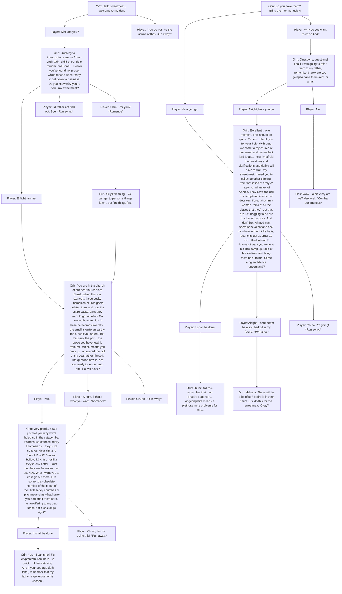

```mermaid
flowchart TD
  ORININTRO0[???: Hello sweetmeat... welcome to my den.] --> ORININTRO0A[Player: Who are you?] & ORININTRO0B[Player: *You do not like the sound of that. Run away.*]
  ORININTRO0A --> ORININTRO1[Orin: Rushing to introductions are we? I am Lady Orin, child of our dear murder lord Bhaal... I know you've found my prose, which means we're ready to get down to business. Do you know why you're here, my sweetmeat?]
  ORININTRO1 --> ORININTRO2A[Player: Enlightnen me.] & ORININTRO2B[Player: Uhm... for you? *Romance*] & ORININTRO2C[Player: I'd rather not find out. Bye! *Run away.*]
  ORININTRO2A --> ORININTRO2A1[Orin: You are in the church of our dear murder lord Bhaal. When this war started... these pesky Thomasian church goers pointed to us and now the entire capital says they want to get rid of us! So now we have to hide in these catacombs like rats... the smell is quite an earthy tone, don't you agree? But that's not the point, the prose you have read is from me, which means you have just answered the call of my dear father himself. The question now is, are you ready to render unto him, like we have?] --> ORININTRO3A & ORININTRO3B & ORININTRO3C
  ORININTRO2B --> ORININTRO2B1[Orin: Silly little thing... we can get to personal things later... but first things first.] --> ORININTRO2A1
  ORININTRO3A[Player: Yes.] --> ORININTRO4
  ORININTRO3B[Player: Alright, if that's what you want. *Romance*] --> ORININTRO4
  ORININTRO3C[Player: Uh, no! *Run away*]
  ORININTRO4[Orin: Very good... now I just told you why we're holed up in the catacombs, it's because of these pesky Thomasians... they stroll up to our dear city and force US out? Can you believe it??? It's not like they're any better... trust me, they are far worse than us. Now, what I want you to do is go out there, lure some stray obsolete member of theirs out of their little hidey churches or pilgrimage sites what-have-you and bring them here, as an offering to my dear father. Not a challenge, right?] --> ORININTRO4A & ORININTRO4B
  ORININTRO4A[Player: It shall be done.] --> ORININTRO5
  ORININTRO4B[Player: Oh no, I'm not doing this! *Run away.*]
  ORININTRO5[Orin: Yes... I can smell his cryptbreath from here. Be quick... I'll be watching. And if your courage doth falter, remember that my father is generous to his chosen...]

  THOMASIAN0[Orin: Do you have them? Bring them to me, quick!] --> THOMASIAN0A & THOMASIAN0B
  THOMASIAN0A[Player: Here you go.] --> THOMASIAN1
  THOMASIAN0B[Player: Why do you want them so bad?] --> THOMASIAN0B1[Orin: Questions, questions! I said I was going to offer them to my father, remember? Now are you going to hand them over, or what?] --> THOMASIAN1A & THOMASIAN1B
  THOMASIAN1A[Player: Alright, here you go.] --> THOMASIAN1
  THOMASIAN1B[Player: No.] --> THOMASIAN1B1[Orin: Wow... a bit feisty are we? Very well. *Combat commences*]
  THOMASIAN1[Orin: Excellent... one moment. This should be quick. Perfect... thank you for your help. With that, welcome to my church of our sweet and benevolent lord Bhaal... now I'm afraid the questions and clarifications and dating will have to wait, my sweetmeat. I need you to collect another offering, from that insolent army or legion or whatever of Ahmed. They have the gall to attempt and invade our dear city. Forget that I'm a woman, think of all the slaves that they'll get that are just begging to be put to a better purpose. And don't fret, Ahmed may seem benevolent and cool or whatever he thinks he is, but he is just as cruel as me... think about it! Anyway, I want you to go to his little camp, get one of his soldiers, and bring them back to me. Same song and dance, understand?] --> THOMASIAN2A & THOMASIAN2B & THOMASIAN2C
  THOMASIAN2A[Player: It shall be done.] --> THOMASIAN2A1[Orin: Do not fail me, remember that I am Bhaal's daughter... angering him means a plethora more problems for you...]
  THOMASIAN2B[Player: Alright. There better be a soft bedroll in my future. *Romance*]  --> THOMASIAN2B1[Orin: Hahaha. There will be a lot of soft bedrolls in your future, just do this for me, sweetmeat. Okay?]
  THOMASIAN2C[Player: Oh no, I'm going! *Run away.*]

  
```
