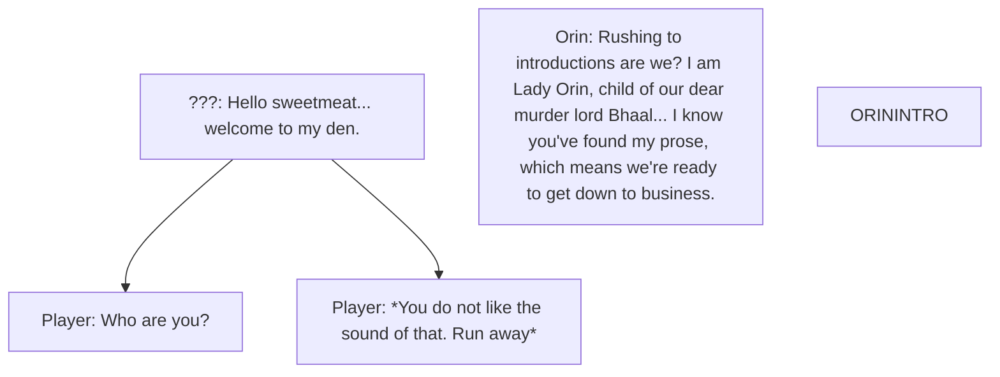

```mermaid
flowchart TD
  ORININTRO0[???: Hello sweetmeat... welcome to my den.] --> ORININTRO0A[Player: Who are you?] & ORININTRO0B[Player: *You do not like the sound of that. Run away*]
  ORININTRO1[Orin: Rushing to introductions are we? I am Lady Orin, child of our dear murder lord Bhaal... I know you've found my prose, which means we're ready to get down to business.]
  ORININTRO
```
