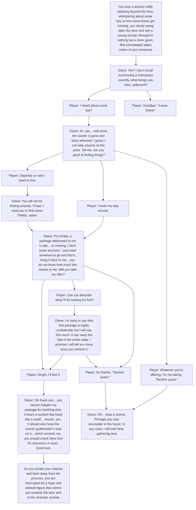
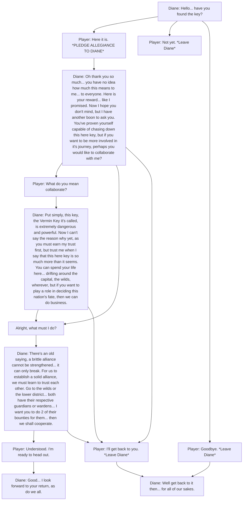
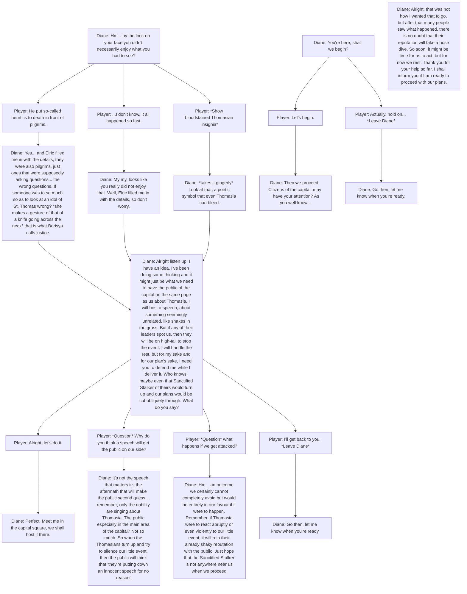
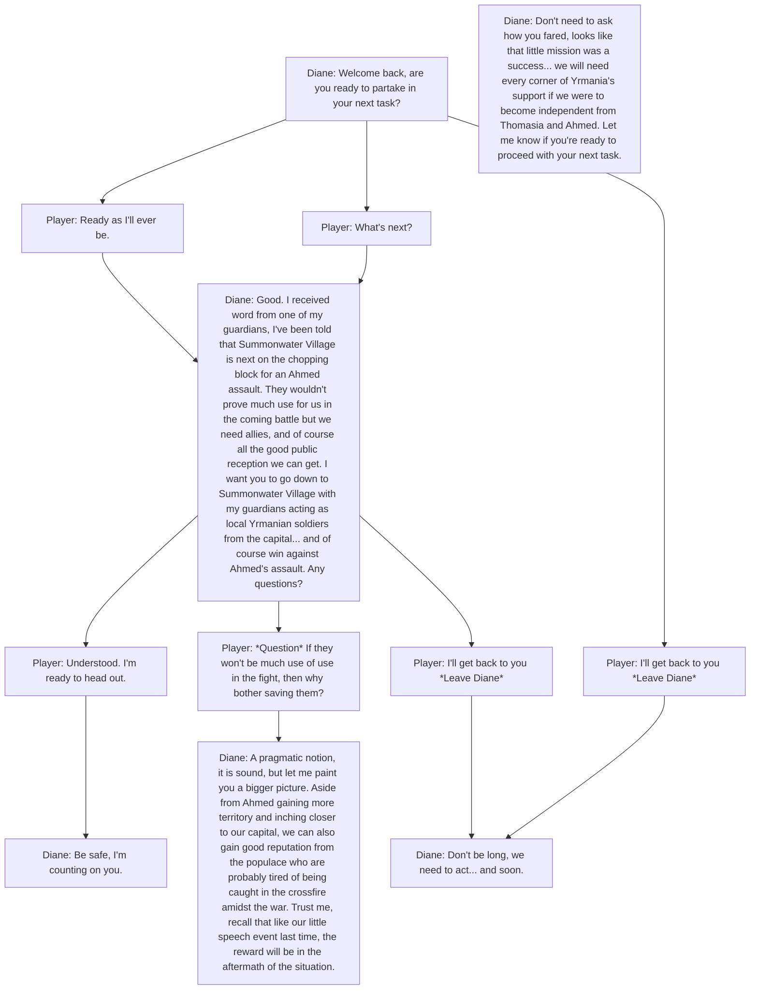
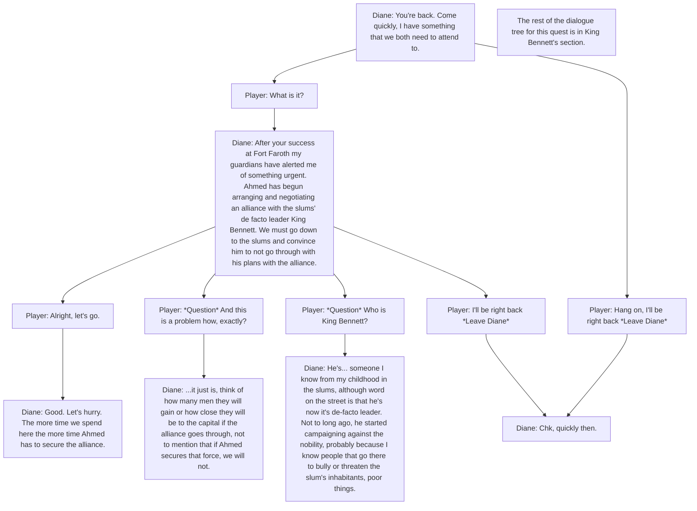
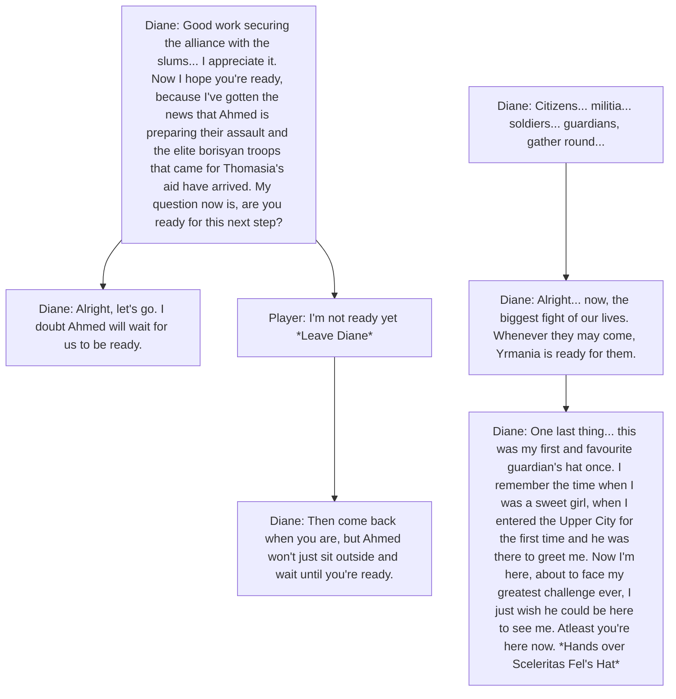

### **Princess Diane Yvette (Heir to the State): In My Time of Need**
- **Quest picked up at:** When the player meets the princess on the way to the Upper City.
- **Step 0**
    - (Diane's questline ties directly with the player's reacquisition and learning about the Vermin Key) if the player chooses to explore the way to the Upper City (where all the nobility lives) early, they are stopped at the gate in a small fortress/drawbridge where the gate is guarded by Senior Knight Hans and a room to the left contains the Princess, who is distressed about the missing key. She doesn't know that the player is actually the one tasked to give her the key, but she tasks the player to go find it (this is basically a failsafe in case the player does not know what they're doing at all)

- **Step 1 (Requires Vermin Key)**
    - Diane will thank the player for bringing back the key and says that she is willing to work with the player after they prove themselves and prove that they are prepared. To proceed, she tasks the player to complete 2 Lower District bounties from Magistrate Ken Nough OR 2 Wilderness bounties from Wenduag.

- **Step 2**
    - Diane says that the player is now ready to be her partner for her plans for the state. She states her plans which are to drive out both the Thomasians and the Legion of Ahmed and push the state of Yrmania to independence for the good of the common people. She points out the flaws in both: although Thomasia seems like the benevolent and good faction their methods and their actual purpose for being in Yrmania is questionable and wrong, in addition she has a disdain for the Legion of Ahmed because as a woman, she has no future or even rights if Ahmed was to take over, not to mention women who are not even in the nobility. She also explains the true purpose of the Vermin Key: there is a defense system underground the state which is comprised of rats and the Vermin Key controls valves at specific areas that release the rats. She then tasks the player to accompany a guardian of hers to the Thomasian Pilgrimage site to spy on the Thomasian officials who are working there. If the player is not affliated with Stalker Svignee at this time, the player can then witness his cruelty in full-view: wherein he orders that those bullying and discriminating the Thomasian pilgrims be executed.
    - 650GP (or the currency decided) is rewarded upon completion.
```mermaid
flowchart TD
  STEP2START[Diane: You've returned, have you completed what I've asked of you?] --> STEP2A[Player: Those bounties were easy. What's next?] & STEP2B[Player: I've completed your request, now we proceed.] & STEP2C[Player: *Show her the bounty proofs silently*]

  STEP2A --> STEP2PLAN[Diane: Confidence suits you. Very well... you're ready to hear the truth. This key controls Yrmania's greatest defense: an underground network of... rats. Yes, voracious and aggressive rats. Thousands upon thousands, waiting beneath our feet. In fact, I have been waiting for this key ever since I was adopted by my stepfather, he was the one who had it constructed.]
  STEP2B --> STEP2PLAN
  STEP2C --> STEP2PLAN

  STEP2PLAN --> STEP2CRITIQUE[Diane: But before we speak of defenses or our plan, you must understand why we're to use them. So you should by now know the two sides: the Thomasians and the Legion, I'll give you a brief overview of why they are bad news. The Thomasians seem benevolent, but the reason they are here is nothing but, as their main purpose is colonization, gaining territory. And Ahmed? His so-called 'liberation' from the nobility and Thomasia would still eventually make chattel of every woman in Yrmania, a liberation that would still condemn hundreds if not thousands of our people into slavery...] --> STEP2Q1[Player: *Question* You sound personal about Ahmed.] & STEP2Q2[Player: *Question* So we're fighting both factions?] & STEP2Q3[Player: *Question* Hang on... what's wrong with Thomasia? They seem nice.] & STEP2Q4[Player: *Question* Rats? You're joking.] & STEP2PROCEED[Player: Alright, what must I do?]

  STEP2Q1 --> STEP2ANSWER1[Diane: I grew up in the slums before my adoption, so I know what it's like to live unpriveleged and without dignity. I know what happens to women under regimes like his, trust me... it's a fate worse than death. The nobility might buy protection, but the rest? I won't allow it to happen to them, not while I draw breath.]
  STEP2Q2 --> STEP2ANSWER2[Diane: Not quite. Right now, the two of us stand no chance bringing down both of them, but our advantage is that they wouldn't expect a thing from us, so listen closely. It's inevitable that Ahmed will assault the capital, and Thomasia will be at the gates waiting for them... then, with the element of surprise, chaos, or what have you, we launch an attack that would cripple and drive out both forces. But first, we need numbers, and that is what we'll be doing while they stand and shake their fists at each other...]
  STEP2Q3 --> STEP2ANSWER3[Diane: Oh it might seem that way, but recall that there are no charities in the lower city or the slums, recall that their base of operations is right beyond that gate, in the Upper City... as a daughter of the Royal Family I have the privilege of knowing why they're here. The faith is being used to sway the nobles, sway my family into allowing Yrmania to be annexed... that's all the Thomasian presence here cares about. That is not to say Thomasia is evil, there's a reason why Borisya, the state it originates from, is so strong... but the Thomasian presence here is far too overextended and capture-driven to care about the people that need their help the most.]
  STEP2Q4 --> STEP2ANSWER4[Diane: My stepfather and his foreign collaborators were... thorough. These aren't common vermin or the ones you see running around in the streets. They're engineered to leave no flesh ungnawed, with a hunger no food can sate. Now passed down to me... to us, as a great weapon to use against invaders.]

  STEP2PROCEED --> STEP2MISSION

   STEP2MISSION[Diane: Here's what you'll do: accompany my guardian Elric to the pilgrimage site, it's now my turn to make sure that you trust me, otherwise our alliance wouldn't be so strong, now would it? Observe how the Thomasians treat their own.] --> STEP2CHOICE[Diane: If you see a strange armoured man, their Sanctified Stalker, they call him, then the show will truly begin... speaking of... don't you find it strange how they have someone named as such? More food for thought for you.]

  STEP2CHOICE --> STEP2C1[Player: Understood. Where do I meet Elric?] & STEP2C2[Player: *Question* Why not gather evidence publicly?] & STEP2C3[Player: *Question* This seems too cautious for someone with a rat weapon.] & STEP2C4[Player: *Nod silently and leave*]

  STEP2C1 --> STEP2END1[Diane: At the stables near the Lower District gate. *Hands you a purse* 650GP for your services thus far. And remember - we need witnesses, not martyrs. Observe only.]
  STEP2C2 --> STEP2END2[Diane: Possible, but shortsighted... remember that Thomasia and especially that Sanctified Stalker of theirs will catch wind of it very quickly, and they would not appreciate a blight forming in their new backyard.]
  STEP2C3 --> STEP2END3[Diane: The time for rats comes later. First we must show the people why they should stand with us before the gnawing begins... and mind you we can't just unleash them whenever we want, we still need to keep the common populace safe. They are contained underground for a reason, so we must do all we can to minimize the areas that we are to unleash the rats in.]
  STEP2C4 --> STEP2END4[Diane: A person of action. Elric will be waiting by the pilgrim tents. Don't keep him long.]

  STEP2END1 --> STEP2FINAL[Diane: Be quick... I have the next part of our plan laid out.]
  STEP2END4 --> STEP2FINAL

  NARRATION1[You arrive at the stables lowly overlooking the Thomasian pilgrimage site below. The same huge stalwart man that you saw when first meeting Diane is here once again, and urges you to come closer, stating that "Diane's mercenary... come quick, the show is about to start." You lay down on the pile of hay beside Elric, and spot ]
```
- **Step 3**
    - After sending the player to spy on the Thomasians, Diane will then task the player to accompany her to the center of the capital wherein she will give a speech and the player is meant to defend her. What happens is a skirmish starts after the Thomasians try to put down the small speech event. Diane will make a comment on "alright, that was not how I wanted that to go, but after that much people saw what happened, there is no doubt that their reputation will take a nose dive. they're starting to get aggressive, so soon it might be time for us to act."
    - 650GP (or the currency decided) and Truesight Amulet, a unique amulet that boosts ranged attacks is rewarded upon completion.


- **Step 4**
    - Diane receives news that the Legion of Ahmed is planning to attack the next village of Summonwater, so she tasks the player to aid the militia there. Afterwards, she will make a comment like "good. we will need every corner of Yrmania's support if we're to become independent. but for now we rest."
    - 650GP (or the currency decided) is rewarded upon completion.

- **Step 5 (Symbiosis)**
    - Diane tasks the player with going to Fort Faroth and requesting the aid of the army stationed there. She requests the player to make contact with Quartermaster A'jak'nir Jeera and request her support and loyalty diplomatically.
    - 800GP (or the currency decided) and Jeera's Arm, a unique armour piece that boosts strength is rewarded upon completion.

```mermaid
flowchart TD
  INTRO[Diane: Welcome back. I should inform you that this next task is a big next step. Are you ready?] --> INTROA[Player: Yes.] & INTROB[Player: What's the next step?] & INTROC[Player: I'll get back to you *Leave Diane*]
  INTROA & INTROB --> INTRO1[Diane: Alright I need you to pay attention... after the ruse that we caused and the attention we're receiving, we still lack the numbers we need to match Ahmed's and Thomasia's numbers, but there is a ready solution. If you peer through the window there, you can see this gargantuan monolith... Fort Faroth. It may come as a surprise, but the state owns the fort and the army stationed there... however we aren't guaranteed their support. Your next mission is exactly so, I need you to visit their quartermaster, A'jak'nir Jeera, and request her support for our cause. Our cause is public knowledge at this point, so you can be more forthcoming about our little... faction, so to speak.] --> INTRO2A & INTRO2B & INTRO2C
  INTRO2A[Player: Understood. I'm ready to head out.] --> END[Diane: One thing before you go, there is something you need to know about Jeera. She's a woman from the Hammerfell, the same faraway state where Ahmed is from... maybe you can use that when persuading her somehow. Be swift, the way I see it, Ahmed is planning his next move after the disaster you caused him at Summonwater.]
  INTRO2B[Player: *Question* Can you tell me about Fort Faroth?] --> INTRO2BANS[Diane: There's a lot of things to know about Fort Faroth, so I need you to be specific. What do you want to know?] --> INTRO2BQA[Player: *Question* Can you tell me more about Jeera?] & INTRO2BQB[Player: *Question* I'm curious about it's history] & INTRO2BQC[Player: *Question* I met Old Sage Nik, why would he hide the Vermin Key? Does he not know it was for you?]
  INTRO2BQA --> INTRO2BQAANS[Diane: Good question, and I doubt she would answer you when it comes to personal questions. Jeera is, like I said, from the Hammerfell, came to Yrmania as just a refugee. Then she enlisted in the state's military, the exact same one that is in Fort Faroth right now. She was a great soldier, though she lost her arm in a raid somewhere, I do not recall much about her unfortunately, and instead of resigning she stuck with Fort Faroth as its quartermaster. For what reason, I don't know... to tell you the truth, I've only spoken with her a couple of times, but what I've just told you is common knowledge in the capital and in Fort Faroth, so you would do well by knowing it.]
  INTRO2BQB --> INTRO2BQBANS[Diane: Fort Faroth is old, probably the oldest structure in Yrmania aside from the... Catacombs. Unlike the Catacombs though, it houses military, not bodies, and some of the greatest minds the state has ever had reside in it, including Jeera and that old sage that my stepfather used to discuss with a lot.] --> INTRO2BQFOLLOWUP[Player: *Question* Wait... catacombs?] --> INTRO2BQFOLLOWUPANS[Diane: Oh yes... maybe they used it to feed the rats, maybe it was because they lost a lot of men, but for some reason, the first residents of Yrmania built an 'Undercity', a sprawling network of caves and what have you underground. Please do not go anywhere near that place, the Undercity is rumoured to be extremely dangerous, and I still need you for my plans for the state.] --> INTRO2BQFOLLOWUP2[Player: *Question* Why is it so dangerous?] --> INTRO2BQANS[Diane: Alright, maybe this will prevent you from approaching that place. A lot of the Undercity is actually inaccessible, and from what I've heard, the Undercity actually housed dangerous criminals, oubliettes, others of the sort. But one of the only places that's left accessible of the Undercity is the Catacombs. One of the priveleges of being in the nobility is knowing much about your people, but one of the things I wish I never knew about was the cult of Bhaal. Rumour has it, is that... when Thomasia arrived and pushed out the pagans from the capital, the Bhaalists withdrew to the catacombs... and this is when I urge you, beg you not to go down there.] --> INTRO2B1A[Player: *Question* What makes Bhaalists so dangerous?] & INTRO2B1B[Player: *Question* Who are they? I need a definite answer.] & INTRO2B1C[Player: Sounds like a fairytale.]
  INTRO2B1A --> INTRO2B1ABRESPONSE[Diane: Their god... Bhaal... is the 'Lord of Murder'... murder is their way of worship, their way of life, their very doctrine. Is that a good enough response? Just please promise me that you wouldn't dare go near them.]
  INTRO2B1B --> INTRO2B1ABRESPONSE
  INTRO2B1C --> INTRO2B1CRESPONSE[Diane: Believe me, believe me not, just promise me not to go to the Catacombs... no good will come from it.]
  INTRO2BQC --> INTRO2BQCANS[Diane: Oh... so Nik is his name... to tell you the truth, I don't know. But that doesn't matter now, he relinquished the key to you... so he must have chosen you or trusted you with the future of the state maybe?]
  INTRO2C[Player: I'll get back to you *Leave Diane*]

  INTROC --> INTROGOODBYE[Diane: Oh... be quick then, we need to act as fast as possible.]
  INTRO2C --> INTROGOODBYE
  
```

- **Step 6 (I Am What I Am: which requires completion of Symbiosis)**
    - Diane gets word that Ahmed himself has started negotiating an alliance and peace-deal with the de-facto leader of the slums, King Bennett. Diane says that she knows King Bennett from when she was still a child living in the slums and urges that the player accompany her and aid her in promising King Bennett to stay neutral or even aid Diane in the upcoming war.
    - 800GP (or the currency decided) and Bennett's Rapier, a unique rapier is rewarded upon completion.

- **Step 7 (Pre-finale)**
    - Just before Ahmed leads his massive assault on the capital and the Thomasians also rally their foreign Borisyan military to attempt and repel them, Diane asks the player once again to accompany and protect her for a speech in the capital, but this time the capital streets are full of militiamen, state soldiers, Upper City knights, and her personal guardians. She gives a rallying speech, making notes about "I know we are surrounded, but think of what we can achieve once this is all over..." and "this is our home... will you really allow the likes of Thomasia or Ahmed's barbarians to take it from you?". The crowd is roused and inspired, and Diane informs the player that whenever the fight may happen, Yrmania is ready.
    - 1000GP (or the currency decided) and Sceleritas Fel's Hat, a unique item that greatly increases initiative (or whatever turn order system, basically it helps you go first) is rewarded after the speech. Diane hands it to the player, gently stating "this was my first and favourite guardian's hat once. I remember the time when I was a sweet girl, when I entered the Upper City for the first time and he was there to greet me. Now I'm here, about to face my greatest challenge ever, I just wish he could be here to see me. Atleast you're here now."

