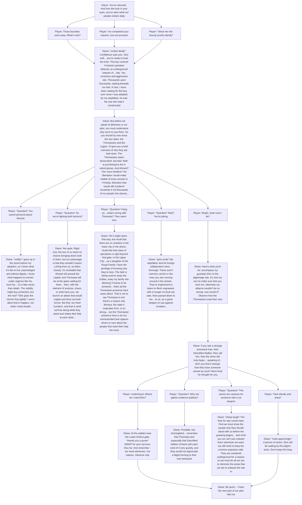

### **Princess Diane Yvette (Heir to the State): In My Time of Need**
- **Quest picked up at:** When the player meets the princess on the way to the Upper City.
- **Step 0**
    - (Diane's questline ties directly with the player's reacquisition and learning about the Vermin Key) if the player chooses to explore the way to the Upper City (where all the nobility lives) early, they are stopped at the gate in a small fortress/drawbridge where the gate is guarded by Senior Knight Hans and a room to the left contains the Princess, who is distressed about the missing key. She doesn't know that the player is actually the one tasked to give her the key, but she tasks the player to go find it (this is basically a failsafe in case the player does not know what they're doing at all)

- **Step 1 (Requires Vermin Key)**
    - Diane will thank the player for bringing back the key and says that she is willing to work with the player after they prove themselves and prove that they are prepared. To proceed, she tasks the player to complete 2 Lower District bounties from Magistrate Ken Nough OR 2 Wilderness bounties from Wenduag.

- **Step 2**
    - Diane says that the player is now ready to be her partner for her plans for the state. She states her plans which are to drive out both the Thomasians and the Legion of Ahmed and push the state of Yrmania to independence for the good of the common people. She points out the flaws in both: although Thomasia seems like the benevolent and good faction their methods and their actual purpose for being in Yrmania is questionable and wrong, in addition she has a disdain for the Legion of Ahmed because as a woman, she has no future or even rights if Ahmed was to take over, not to mention women who are not even in the nobility. She also explains the true purpose of the Vermin Key: there is a defense system underground the state which is comprised of rats and the Vermin Key controls valves at specific areas that release the rats. She then tasks the player to accompany a guardian of hers to the Thomasian Pilgrimage site to spy on the Thomasian officials who are working there. If the player is not affliated with Stalker Svignee at this time, the player can then witness his cruelty in full-view: wherein he orders that those bullying and discriminating the Thomasian pilgrims be executed.
    - 650GP (or the currency decided) is rewarded upon completion.

- **Step 3**
    - After sending the player to spy on the Thomasians, Diane will then task the player to accompany her to the center of the capital wherein she will give a speech and the player is meant to defend her. What happens is a skirmish starts after the Thomasians try to put down the small speech event. Diane will make a comment on "alright, that was not how I wanted that to go, but after that much people saw what happened, there is no doubt that their reputation will take a nose dive. they're starting to get aggressive, so soon it might be time for us to act."
    - 650GP (or the currency decided) and Truesight Amulet, a unique amulet that boosts ranged attacks is rewarded upon completion.
- **Step 4**
    - Diane receives news that the Legion of Ahmed is planning to attack the next village of Summonwater, so she tasks the player to aid the militia there. Afterwards, she will make a comment like "good. we will need every corner of Yrmania's support if we're to become independent. but for now we rest."
    - 650GP (or the currency decided) is rewarded upon completion.
- **Step 5 (Symbiosis)**
    - Diane tasks the player with going to Fort Faroth and requesting the aid of the army stationed there. She requests the player to make contact with Quartermaster A'jak'nir Jeera and request her support and loyalty diplomatically.
    - 800GP (or the currency decided) and Jeera's Arm, a unique armour piece that boosts strength is rewarded upon completion.
- **Step 6 (I Am What I Am: which requires completion of Symbiosis)**
    - Diane gets word that Ahmed himself has started negotiating an alliance and peace-deal with the de-facto leader of the slums, King Bennett. Diane says that she knows King Bennett from when she was still a child living in the slums and urges that the player accompany her and aid her in promising King Bennett to stay neutral or even aid Diane in the upcoming war.
    - 800GP (or the currency decided) and Bennett's Rapier, a unique rapier is rewarded upon completion.
- **Step 7 (Pre-finale)**
    - Just before Ahmed leads his massive assault on the capital and the Thomasians also rally their foreign Borisyan military to attempt and repel them, Diane asks the player once again to accompany and protect her for a speech in the capital, but this time the capital streets are full of militiamen, state soldiers, Upper City knights, and her personal guardians. She gives a rallying speech, making notes about "I know we are surrounded, but think of what we can achieve once this is all over..." and "this is our home... will you really allow the likes of Thomasia or Ahmed's barbarians to take it from you?". The crowd is roused and inspired, and Diane informs the player that whenever the fight may happen, Yrmania is ready.
    - 1000GP (or the currency decided) and Sceleritas Fel's Hat, a unique item that greatly increases initiative (or whatever turn order system, basically it helps you go first) is rewarded after the speech. Diane hands it to the player, gently stating "this was my first and favourite guardian's hat once. I remember the time when I was a sweet girl, when I entered the Upper City for the first time and he was there to greet me. Now I'm here, about to face my greatest challenge ever, I just wish he could be here to see me. Atleast you're here now."
 
      
