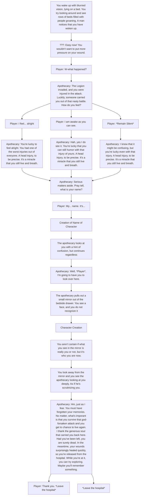

```mermaid
flowchart TD
    A[You wake up with blurried vision, lying on a bed. You try looking around and see rows of beds filled with people groaning. A man notices that you have woken up.]
    A --> B[???: Easy now! You wouldn't want to put more pressure on your wound.] --> C[Player: W-what happened?]

    C --> D[Apothecary: The Legion invaded, and you were injured in the attack. Luckily, someone carried you out of that nasty battle. How do you feel?]
    D --> E[Player: I feel... alright]
    D --> F[Player: I am awake as you can see.]
    D --> G[Player: *Remain Silent*]

    E  --> H[Apothecary: You're lucky to feel alright. You had one of the worst injuries out of everyone. A head injury, to be precise. It's a miracle that you still live and breath.]
    F --> I[Apothecary: Hah, yes I do see it. You're lucky that you can still humor with that injury of yours. A head injury, to be precise. It's a miracle that you still live and breath.]
    G --> J[Apothecary: I know that it might be confusing, but you're lucky even with that injury. A head injury, to be precise. It's a miracle that you still live and breath.]

    H & I & J --> K[Apothecary: Serious matters aside. Pray tell, what is your name?]
    K --> L[Player: My...  name. It's...]
    L --> M[Creation of Name of Character]

    M --> N[The apothecary looks at you with a hint of confusion, but continues regardless]
    N --> O[Apothecary: Well, *Player*, I'm going to have you to look over here.]
    O --> P[The apothecary pulls out a small mirror out of the bedside drawer. You see a face, and you do not recognize it]
    P --> Q[Character Creation]

    Q --> R[You aren’t certain if what you see in the mirror is really you or not, but it’s who you are now.]
    R --> S[You look away from the mirror and you see the apothecary looking at you deeply. As if he's scrutinizing you.]

    S --> T[Apothecary: Hm, just as I fear. You must have forgotten your memories. No matter, what's imporant is that you survive that god-forsaken attack and you get to chance to live again. I thank the generous soul that carried you back here. Had you've been left, you are surely dead. In the meantime, your wounds surprisingly healed quickly, so you're released from the hospital. While you're at it, you can try exploring. Maybe you'll remember something.]

    T --> U[Player: Thank you. *Leave the hospital*]
    T --> V[*Leave the hospital*]
    
```
