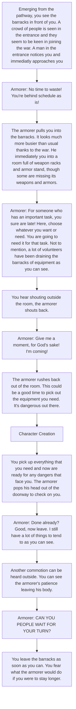

```mermaid
flowchart TD
  A[Emerging from the pathway, you see the barracks in front of you. A crowd of people is seen in the entrance and they seem to be keen in joining the war. A man in the entrance notices you and immediatly approaches you]
  A --> B[Armorer: No time to waste! You're behind schedule as is!]
  B --> C[The armorer pulls you into the barracks. It looks much more busier than usual thanks to the war. He immediately you into a room full of weapon racks and armor stand, though some are missing its weapons and armors.]
  C --> D[Armorer: For someone who has an important task, you sure are late! Here, choose whatever you want or need. You are going to need it for that task. Not to mention, a lot of volunteers have been draining the barracks of equipment as you can see.]
  D --> E[You hear shouting outside the room, the armorer shouts back.]
  E --> F[Armorer: Give me a moment, for God's sake! I'm coming!]
  F --> G[The armorer rushes back out of the room. This could be a good time to pick out the equipment you need. It's dangerous out there.]
  G --> H[Character Creation]
  H --> I[You pick up everything that you need and now are ready for any dangers that face you. The armorer pops his head out of the doorway to check on you.]
  I --> J[Armorer: Done already? Good, now leave. I still have a lot of things to tend to as you can see.]
  J --> K[Another commotion can be heard outside. You can see the armorer's patience leaving his body.]
  K --> L[Armorer: CAN YOU PEOPLE WAIT FOR YOUR TURN?]
  L --> M[You leave the barracks as soon as you can. You fear what the armorer would do if you were to stay longer.]
  
```
