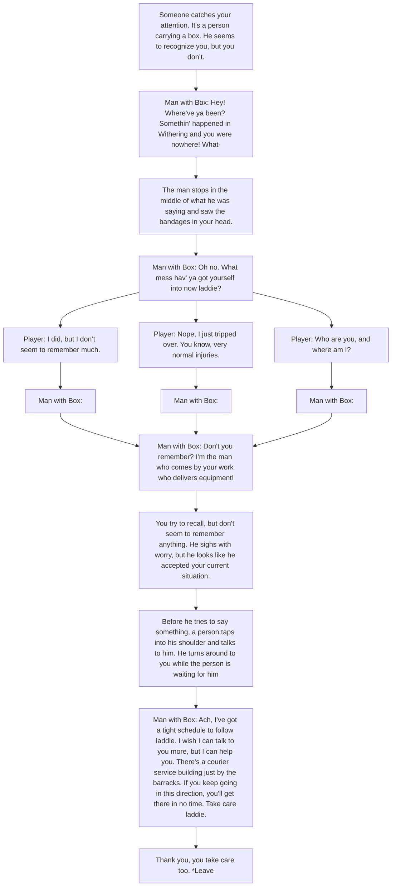

```mermaid
flowchart TD
  A[Someone catches your attention. It's a person carrying a box. He seems to recognize you, but you don’t.]
  A --> B[Man with Box: Hey! Where've ya been? Somethin' happened in Withering and you were nowhere! What-]
  B --> C[The man stops in the middle of what he was saying and saw the bandages in your head.]
  C --> D[Man with Box: Oh no. What mess hav' ya got yourself into now laddie?]

  D --> E[Player: I did, but I don’t seem to remember much.]
  D --> F[Player: Nope, I just tripped over. You know, very normal injuries.]
  D --> G[Player: Who are you, and where am I?]

  E --> H[Man with Box: ]
  F --> I[Man with Box: ]
  G --> J[Man with Box: ]

  H & I & J --> K[Man with Box: Don't you remember? I'm the man who comes by your work who delivers equipment!]
  K --> L[You try to recall, but don't seem to remember anything. He sighs with worry, but he looks like he accepted your current situation.]
  L --> M[Before he tries to say something, a person taps into his shoulder and talks to him. He turns around to you while the person is waiting for him]
  M --> N[Man with Box: Ach, I've got a tight schedule to follow laddie. I wish I can talk to you more, but I can help you. There's a courier service building just by the barracks. If you keep going in this direction, you'll get there in no time. Take care laddie.]

  N --> O[Thank you, you take care too. *Leave]

```
