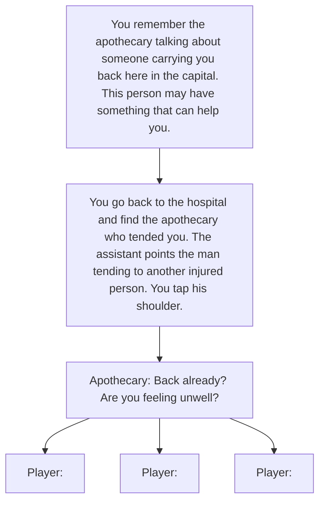

```mermaid
flowchart TD
  A[You remember the apothecary talking about someone carrying you back here in the capital. This person may have something that can help you.]
  A --> B[You go back to the hospital and find the apothecary who tended you. The assistant points the man tending to another injured person. You tap his shoulder.]
  B --> C[Apothecary: Back already? Are you feeling unwell?]

  C --> D[Player: ]
  C --> E[Player: ]
  C --> F[Player: ]

```
