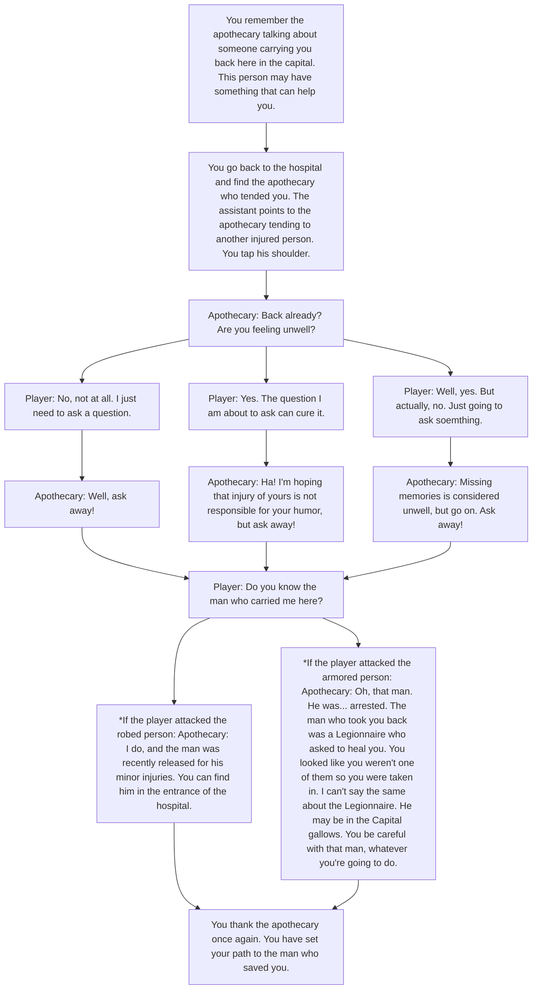

```mermaid
flowchart TD
  A[You remember the apothecary talking about someone carrying you back here in the capital. This person may have something that can help you.]
  A --> B[You go back to the hospital and find the apothecary who tended you. The assistant points to the apothecary tending to another injured person. You tap his shoulder.]
  B --> C[Apothecary: Back already? Are you feeling unwell?]

  C --> D[Player: No, not at all. I just need to ask a question.]
  C --> E[Player: Yes. The question I am about to ask can cure it.]
  C --> F[Player: Well, yes. But actually, no. Just going to ask soemthing.]

  D --> G[Apothecary: Well, ask away!]
  E --> H[Apothecary: Ha! I'm hoping that injury of yours is not responsible for your humor, but ask away!]
  F --> I[Apothecary: Missing memories is considered unwell, but go on. Ask away!]

  G & H & I --> J[Player: Do you know the man who carried me here?]
  J --> K[*If the player attacked the robed person: Apothecary: I do, and the man was recently released for his minor injuries. You can find him in the entrance of the hospital.]
  J --> L[*If the player attacked the armored person: Apothecary: Oh, that man. He was... arrested. The man who took you back was a Legionnaire who asked to heal you. You looked like you weren't one of them so you were taken in. I can't say the same about the Legionnaire. He may be in the Capital gallows. You be careful with that man, whatever you're going to do.]

  K & L --> M[You thank the apothecary once again. You have set your path to the man who saved you.]

```
