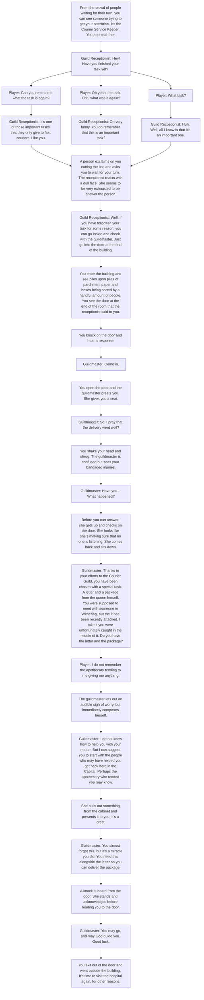

```mermaid
flowchart TD
  A[From the crowd of people waiting for their turn, you can see someone trying to get your atterntion. It's the Courier Service Keeper. You approach her.]
  A --> B[Guild Receptionist: Hey! Have you finished your task yet?]
  B --> D[Player: Can you remind me what the task is again?]
  B --> E[Player: Oh yeah, the task. Uhh, what was it again?]
  B --> F[Player: What task?]

  D --> G[Guild Receptionist: It's one of those important tasks that they only give to fast couriers. Like you.]
  E --> H[Guild Receptionist: Oh very funny. You do remember that this is an important task?]
  F --> I[Guild Recpetionist: Huh. Well, all I know is that it's an important one.]

  G & H & I --> J[A person exclaims on you cutting the line and asks you to wait for your turn. The receptionist reacts with a dull face. She seems to be very exhausted to be answer the person.]
  J --> K[Guild Receptionist: Well, if you have forgotten your task for some reason, you can go inside and check with the guildmaster. Just go into the door at the end of the building.]

  K --> L[You enter the building and see piles upon piles of parchment paper and boxes being sorted by a handful amount of people. You see the door at the end of the room that the receptionist said to you.]
  L --> M[You knock on the door and hear a response.]
  M --> N[Guildmaster: Come in.]
  N --> O[You open the door and the guildmaster greets you. She gives you a seat.]
  O --> P[Guildmaster: So, I pray that the delivery went well?]
  P --> Q[You shake your head and shrug. The guildmaster is confused but sees your bandaged injuries.]
  Q --> R[Guildmaster: Have you... What happened?]
  R --> S[Before you can answer, she gets up and checks on the door. She looks like she's making sure that no one is listening. She comes back and sits down.]

  S --> T[Guildmaster: Thanks to your efforts to the Courier Guild, you have been chosen with a special task. A letter and a package from the queen herself. You were supposed to meet with someone in Withering, but the it has been recently attacked. I take it you were unfortunately caught in the middle of it. Do you have the letter and the package?]
  T --> U[Player: I do not remember the apothecary tending to me giving me anything.]
  U --> V[The guildmaster lets out an audible sigh of worry, but immediately composes herself.]
  V --> W[Guildmaster: I do not know how to help you with your matter. But I can suggest you to start with the people who may have helped you get back here in the Capital. Perhaps the apothecary who tended you may know.]

  W --> X[She pulls out something from the cabinet and presents it to you. It's a crest.]
  X --> Y[Guildmaster: You almost forgot this, but it's a miracle you did. You need this alongside the letter so you can deliver the package.]
  Y --> Z[A knock is heard from the door. She stands and acknowledges before leading you to the door.]
  Z --> A1[Guildmaster: You may go, and may God guide you. Good luck.]
  A1 --> B1[You exit out of the door and went outside the building. It's time to visit the hospital again, for other reasons.]

```
