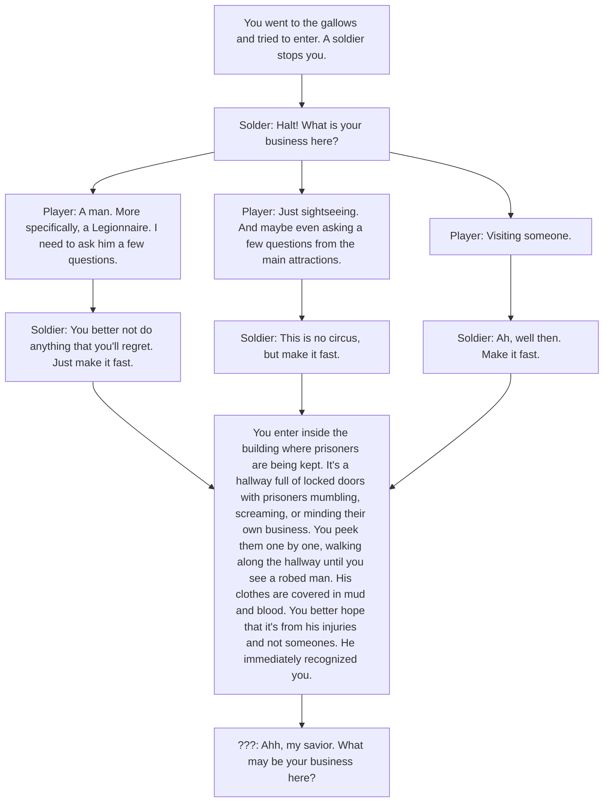

```mermaid
flowchart TD
  A[You went to the gallows and tried to enter. A soldier stops you.]
  A --> B[Solder: Halt! What is your business here?]

  B --> C[Player: A man. More specifically, a Legionnaire. I need to ask him a few questions.]
  B --> D[Player: Just sightseeing. And maybe even asking a few questions from the main attractions.]
  B --> E[Player: Visiting someone.]

  C --> F[Soldier: You better not do anything that you'll regret. Just make it fast.]
  D --> G[Soldier: This is no circus, but make it fast.]
  E --> H[Soldier: Ah, well then. Make it fast.]

  F & G & H --> I[You enter inside the building where prisoners are being kept. It's a hallway full of locked doors with prisoners mumbling, screaming, or minding their own business. You peek them one by one, walking along the hallway until you see a robed man. His clothes are covered in mud and blood. You better hope that it's from his injuries and not someones. He immediately recognized you.]

  I --> J[???: Ahh, my savior. What may be your business here?]

```
