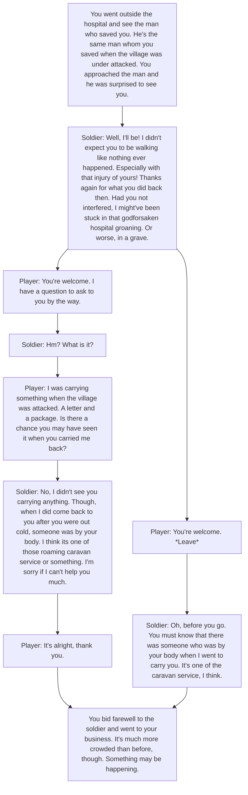

```mermaid
flowchart TD
  A[You went outside the hospital and see the man who saved you. He's the same man whom you saved when the village was under attacked. You approached the man and he was surprised to see you.]
  A --> B[Soldier: Well, I'll be! I didn't expect you to be walking like nothing ever happened. Especially with that injury of yours! Thanks again for what you did back then. Had you not interfered, I might've been stuck in that godforsaken hospital groaning. Or worse, in a grave.]
  B --> C[Player: You're welcome. I have a question to ask to you by the way.]
  B --> D[Player: You're welcome. *Leave*]

  C --> E[Soldier: Hm? What is it?]
  E --> F[Player: I was carrying something when the village was attacked. A letter and a package. Is there a chance you may have seen it when you carried me back?]
  F --> G[Soldier: No, I didn't see you carrying anything. Though, when I did come back to you after you were out cold, someone was by your body. I think its one of those roaming caravan service or something. I'm sorry if I can't help you much.]
  G --> H[Player: It's alright, thank you.]
  H --> I[You bid farewell to the soldier and went to your business. It's much more crowded than before, though. Something may be happening.]

  D --> J[Soldier: Oh, before you go. You must know that there was someone who was by your body when I went to carry you. It's one of the caravan service, I think.]
  J --> I
```
