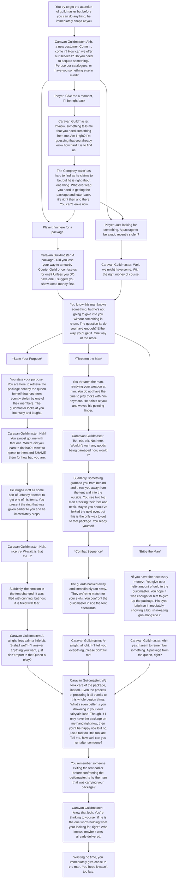

```mermaid
flowchart TD
  A[You try to get the attention of guildmaster but before you can do anything, he immediately snaps at you.]
  A --> B[Caravan Guildmaster: Ahh, a new customer. Come in, come in! How can we offer our services? Do you need to acquire something? Peruse our catalogues, or have you something else in mind?]

  B --> C[Player: I'm here for a package.]
  B --> D[Player: Just looking for something. A package to be exact, recently stolen?]
  B --> E[Player: Give me a moment, I'll be right back]

  E --> F[Caravan Guildmaster: Y'know, something tells me that you need something from me. Am I right? I'm guessing that you already know how hard it is to find us.]
  F --> G[The Company wasn't as hard to find as he claims to be, but he is right about one thing. Whatever lead you need to getting the package and letter back, it's right then and there. You can't leave now.]
  G --> C & D

  C --> H[Caravan Guildmaster: A package? Did you lose your way to a nearby Courier Guild or confuse us for one? Unless you DO have one, I suggest you show some money first.]
  D --> I[Caravan Guildmaster: Well, we might have some. With the right money of course.]

  H & I --> J[You know this man knows something, but he's not going to give it to you without something in return. The question is: do you have enough? Either way, you'll get it. One way or the other.]

  J --> K[*State Your Purpose*]
  J --> L[*Threaten the Man*]
  J --> M[*Bribe the Man*]

  K --> N[You state your purpose. You are here to retrieve the package sent by the queen herself that has been recently stolen by one of their members. The guildmaster looks at you intensely and laughs.]
  N --> O[Caravan Guildmaster: Hah! You almost got me with that one. Where did you learn to do that? I wan't to speak to them and SHAME them for how bad you are.]
  O --> P[He laughs it off as some sort of unfunny attempt to get one of his items. You present the ring that was given earlier to you and he immediately stops.]
  P --> Q[Caravan Guildmaster: Hah, nice try- W-wait, is that the...?]
  Q --> R[Suddenly, the emotion in the tent changed. It was filled with cunning, but now, it is filled with fear.]
  R --> S[Caravan Guildmaster: A-alright, let's calm a little bit. S-shall we? I-I'll answer anything you want, just don't report to the Queen o-okay?]

  L --> T[You threaten the man, readying your weapon at him. You do not have the time to play tricks with him anymore. He points at you and waves his pointing finger.]
  T --> U[Caranvan Guildmaster: Tsk, tsk, tsk. Not here. Wouldn't want any goods being damaged now, would I?]
  U --> V[Suddenly, something grabbed you from behind and threw you away from the tent and into the outside. You see two big men cracking their fists and neck. Maybe you should've forked the gold over, but this is the only way to get to that package. You ready yourself.]

  V --> W[*Combat Sequence*]

  W --> X[The guards backed away and immediately ran away. They we're no match for your skills. You confront the guildmaster inside the tent afterwards.]
  X --> Y[Caravan Guildmaster: A-alright, alright. I-I'll tell you everything, please don't kill me!]

  M --> A1[*If you have the necessary money*: You give up a hefty amount of gold to the guildmaster. You hope it was enough for him to give up the package. His eyes brighten immediately, showing a big, shin-eating grin alongside it.]
  A1 --> B1[Caravan Guildmaster: Ahh, yes. I seem to remember something. A package from the queen, right?]

  S & Y & B1 --> C1[Caravan Guildmaster: We took care of the package, indeed. Even the process of procuring it all thanks to this whole Legion thing. What’s even better is you drowning in your own fairytale land. Though, if I only have the package on my hand right now, then you’ll be happy no? But no, just a tad too little too late. Tell me, how well can you run after someone?]

  C1 --> D1[You remember someone exiting the tent earlier before confronting the guildmaster. Is he the man that was carrying your package?]
  D1 --> E1[Caravan Guildmaster: I know that look. You're thinking to yourself if he is the one who's holding what your looking for, right? Who knows, maybe it was already delivered.]
  E1 --> F1[Wasting no time, you immediately give chase to the man. You hope it wasn't too late.]

```
