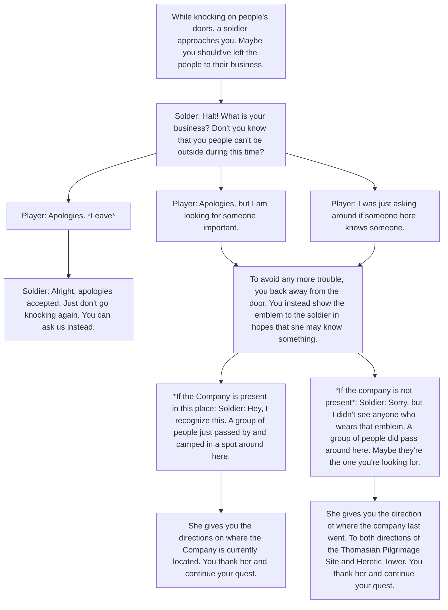

```mermaid
flowchart TD
  A[While knocking on people's doors, a soldier approaches you. Maybe you should've left the people to their business.]
  A --> B[Solder: Halt! What is your business? Don't you know that you people can't be outside during this time?]
  B --> C[Player: Apologies, but I am looking for someone important.]
  B --> D[Player: I was just asking around if someone here knows someone.]
  B --> E[Player: Apologies. *Leave*]

  E --> G[Soldier: Alright, apologies accepted. Just don't go knocking again. You can ask us instead.]

  C & D --> F[To avoid any more trouble, you back away from the door. You instead show the emblem to the soldier in hopes that she may know something.]

  F --> H[*If the Company is present in this place: Soldier: Hey, I recognize this. A group of people just passed by and camped in a spot around here.]
  H --> I[She gives you the directions on where the Company is currently located. You thank her and continue your quest.]

  F --> J[*If the company is not present*: Soldier: Sorry, but I didn't see anyone who wears that emblem. A group of people did pass around here. Maybe they're the one you're looking for.]
  J --> K[She gives you the direction of where the company last went. To both directions of the Thomasian Pilgrimage Site and Heretic Tower. You thank her and continue your quest.]

```
