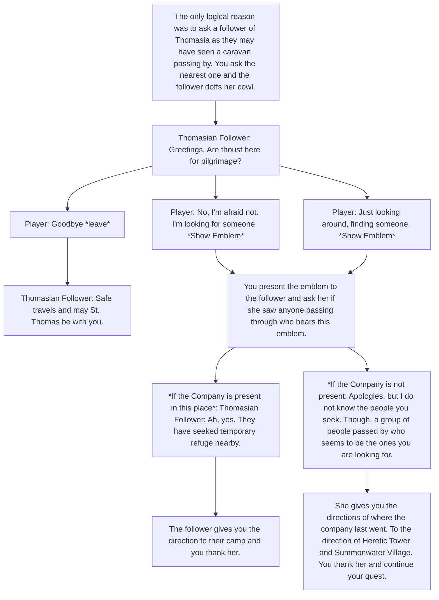

```mermaid
flowchart TD
  A[The only logical reason was to ask a follower of Thomasia as they may have seen a caravan passing by. You ask the nearest one and the follower doffs her cowl.]
  A --> B[Thomasian Follower: Greetings. Are thoust here for pilgrimage?]
  B --> C[Player: No, I'm afraid not. I'm looking for someone. *Show Emblem*]
  B --> D[Player: Just looking around, finding someone. *Show Emblem*]
  B --> E[Player: Goodbye *leave*]

  E --> F[Thomasian Follower: Safe travels and may St. Thomas be with you.]

  C & D --> G[You present the emblem to the follower and ask her if she saw anyone passing through who bears this emblem.]

  G --> H[*If the Company is present in this place*: Thomasian Follower: Ah, yes. They have seeked temporary refuge nearby.]
  H --> I[The follower gives you the direction to their camp and you thank her.]

  G --> J[*If the Company is not present: Apologies, but I do not know the people you seek. Though, a group of people passed by who seems to be the ones you are looking for.]
  J --> K[She gives you the directions of where the company last went. To the direction of Heretic Tower and Summonwater Village. You thank her and continue your quest.]
```
