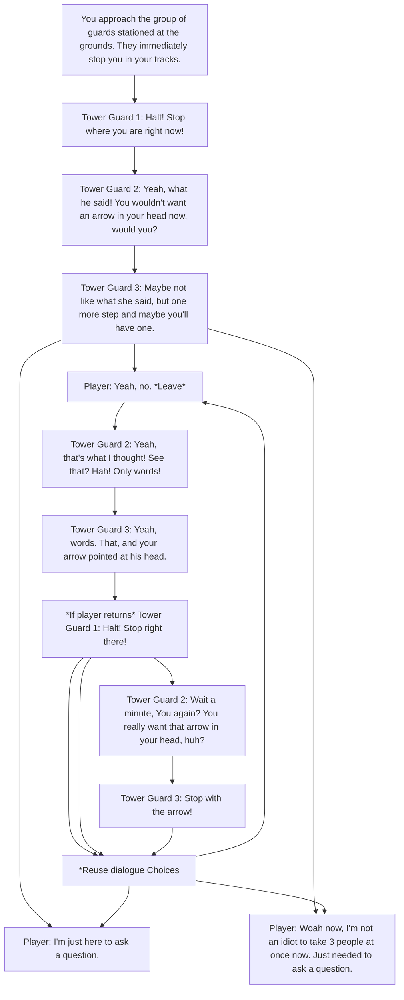

```mermaid
flowchart TD

  A[You approach the group of guards stationed at the grounds. They immediately stop you in your tracks.]
  A --> B[Tower Guard 1: Halt! Stop where you are right now!]
  B --> C[Tower Guard 2: Yeah, what he said! You wouldn't want an arrow in your head now, would you?]
  C --> D[Tower Guard 3: Maybe not like what she said, but one more step and maybe you'll have one.]

  D --> E[Player: I'm just here to ask a question.]
  D --> F[Player: Woah now, I'm not an idiot to take 3 people at once now. Just needed to ask a question.]
  D --> G[Player: Yeah, no. *Leave*]

  G --> H[Tower Guard 2: Yeah, that's what I thought! See that? Hah! Only words!]
  H --> I[Tower Guard 3: Yeah, words. That, and your arrow pointed at his head.]

  I --> J[*If player returns* Tower Guard 1: Halt! Stop right there!]
  J --> K[Tower Guard 2: Wait a minute, You again? You really want that arrow in your head, huh?]
  K --> L[Tower Guard 3: Stop with the arrow!]

  J & J & L --> M[*Reuse dialogue Choices]
  M --> E & F & G
```
