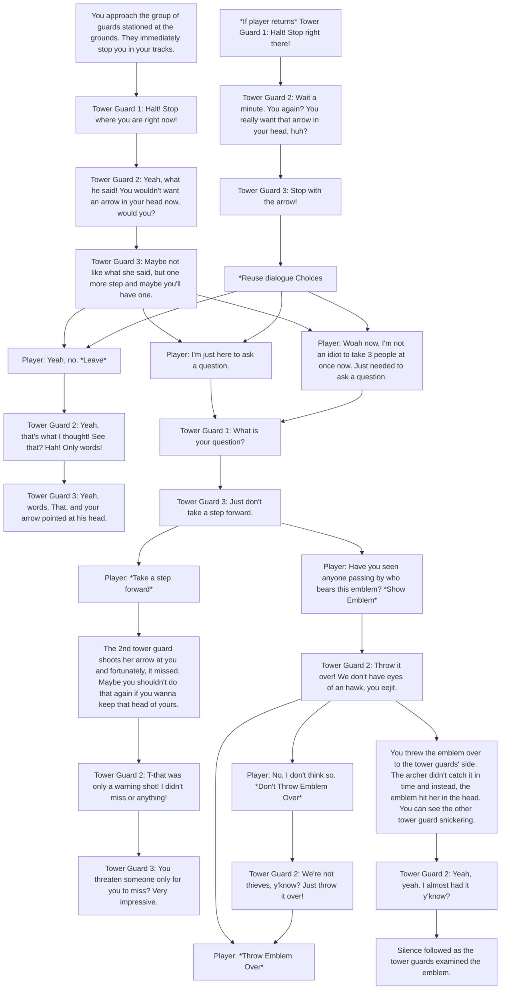

```mermaid
flowchart TD

  A[You approach the group of guards stationed at the grounds. They immediately stop you in your tracks.]
  A --> B[Tower Guard 1: Halt! Stop where you are right now!]
  B --> C[Tower Guard 2: Yeah, what he said! You wouldn't want an arrow in your head now, would you?]
  C --> D[Tower Guard 3: Maybe not like what she said, but one more step and maybe you'll have one.]

  D --> E[Player: I'm just here to ask a question.]
  D --> F[Player: Woah now, I'm not an idiot to take 3 people at once now. Just needed to ask a question.]
  D --> G[Player: Yeah, no. *Leave*]

  G --> H[Tower Guard 2: Yeah, that's what I thought! See that? Hah! Only words!]
  H --> I[Tower Guard 3: Yeah, words. That, and your arrow pointed at his head.]

  J[*If player returns* Tower Guard 1: Halt! Stop right there!]
  J --> K[Tower Guard 2: Wait a minute, You again? You really want that arrow in your head, huh?]
  K --> L[Tower Guard 3: Stop with the arrow!]

  L --> M[*Reuse dialogue Choices]
  M --> E & F & G

  E & F --> N[Tower Guard 1: What is your question?]
  N --> O[Tower Guard 3: Just don't take a step forward.]

  O --> P[Player: Have you seen anyone passing by who bears this emblem? *Show Emblem*]
  O --> Q[Player: *Take a step forward*]

  Q --> R[The 2nd tower guard shoots her arrow at you and fortunately, it missed. Maybe you shouldn't do that again if you wanna keep that head of yours.]
  R --> S[Tower Guard 2: T-that was only a warning shot! I didn't miss or anything!]
  S --> T[Tower Guard 3: You threaten someone only for you to miss? Very impressive.]

  P --> U[Tower Guard 2: Throw it over! We don't have eyes of an hawk, you eejit.]
  U --> V[Player: *Throw Emblem Over*]
  U --> W[Player: No, I don't think so. *Don't Throw Emblem Over*]

  W --> X[Tower Guard 2: We're not thieves, y'know? Just throw it over!]
  X --> V

  U --> Y[You threw the emblem over to the tower guards' side. The archer didn't catch it in time and instead, the emblem hit her in the head. You can see the other tower guard snickering.]
  Y --> Z[Tower Guard 2: Yeah, yeah. I almost had it y'know?]

  Z --> A1[Silence followed as the tower guards examined the emblem.]

  
```
