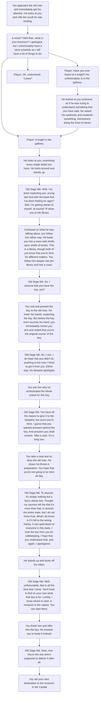

```mermaid
flowchart TD
  A[You approach the old man and immediately get his attenton. He looks at you and rolls the scroll he was reading.]
  A --> B[A visitor? Well then, what is your business? I apologize, but I unfortunately have a strict schedule as I still have a lot of things to do.]
  B --> C[Player: A knight in the gallows.]
  B --> D[Player: Have you ever heard of a knight? He, unfortunately, is in the gallows.]
  B --> E[Player: Oh, understood. *Leave*]

  D --> U[He looked at you confused, as if he was trying to understand something that you have said. He raised his eyebrows and muttered something, somewhere along the lines of clever.]
  U --> C

  C --> F[He looks at you, examining every single detail you have. He looks around and stands up.]
  F --> G[Old Sage Nik: Well, I've been expecting you, young lad! And with the book that I've been finding for ages? Bah, I'm getting ahead of myself, of course! I'll show you to the library.]
  G --> H[Confused on what he was talking about, you follow him either way. He leads you into a room with shelfs upon shelfs of books. This is a library, though both of you know that you're here for different matters. You follow him deeper into the library and into a room.]

  H --> I[Old Sage Nik: So, I assume that you have the key, yes?]
  I --> J[You nod and present the key to the old man. He lower his hands, expecting the key. But before the key even touches his hand, you immediately retract you arm and stated that you're the original courier of the key.]
  J --> K[Old Sage Nik: Ah, I see. I do hope that you didn't do anything to the man I hired to get it from you. Either way, my deepest apologies.]
  K --> L[You ask him why he orchestrated the whole ordeal for this key.]
  L --> M[Old Sage Nik: You have all the reason to give it to the recipient, but since you're here, I guess that you wanted answers behind the key. And answers you shall recieve. Take a seat. It's a long one.]

  M --> N[You take a seat and so does the old man. He clears his throat in preparation. You hope that you're not going to be here all day.]
  N --> O[Old Sage Nik: To anyone, it's simply nothing but a fancy dandy key. Though, my sources tell me that it's more than that. It controls the entire state, but I do not know how. What I do know is if it fell to the wrong hands, it can spell doom to everyone in this state. I took the key from you for safekeeping, I hope that you understand that, and again, I apologized.]
  O --> P[He stands up and dusts off his robes.]
  P --> Q[Old Sage Nik: Well, unfortunately, that is all the time that I have. You'll have to find on your own what that key is for. Luckily, I know where to start. A museum in the capital. You can start there.]
  Q --> R[You thank him and offer him the key. He insisted you to keep it instead.]
  R --> S[Old Sage Nik: Now, now. You're the one who's supposed to deliver it after all.]
  S --> T[You set your next destination to the museum in the Capital]

```
