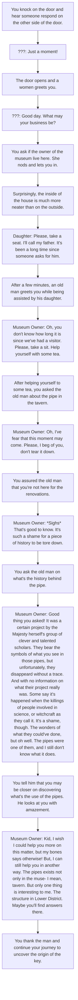

```mermaid
flowchart TD
  A[You knock on the door and hear someone respond on the other side of the door.]
  A --> B[???: Just a moment!]
  B --> C[The door opens and a women greets you.]
  C --> D[???: Good day. What may your business be?]
  D --> E[You ask if the owner of the museum live here. She nods and lets you in.]
  E --> F[Surprisingly, the inside of the house is much more neater than on the outside.]

  F --> G[Daughter: Please, take a seat. I'll call my father. It's been a long time since someone asks for him.]

  G --> H[After a few minutes, an old man greets you while being assisted by his daughter.]
  H --> I[Museum Owner: Oh, you don't know how long it is since we've had a visitor. Please, take a sit. Help yourself with some tea.]
  I --> J[After helping yourself to some tea, you asked the old man about the pipe in the tavern.]
  J --> K[Museum Owner: Oh, I've fear that this moment may come. Please, I beg of you, don't tear it down.]
  K --> L[You assured the old man that you're not here for the renovations.]
  L --> M[Museum Owner: *Sighs* That's good to know. It's such a shame for a piece of history to be tore down.]
  M --> N[You ask the old man on what's the history behind the pipe.]
  N --> O[Museum Owner: Good thing you asked! It was a certain project by the Majesty herself's group of clever and talented scholars. They bear the symbols of what you see in those pipes, but unfortunately, they disappeard without a trace. And with no information on what their project really was. Some say it's happened when the killings of people involved in science, or witchcraft as they call it. It's a shame, though. The wonders of what they could've done, but oh well. The pipes were one of them, and I still don't know what it does.]
  O --> P[You tell him that you may be closer on discovering what's the use of the pipes. He looks at you with amazement.]
  P --> Q[Museum Owner: Kid, I wish I could help you more on this matter, but my bones says otherwise! But, I can still help you in another way. The pipes exists not only in the muse- I mean, tavern. But only one thing is interesting to me. The structure in Lower District. Maybe you'll find answers there.]
  Q --> R[You thank the man and continue your journey to uncover the origin of the key.]

```
