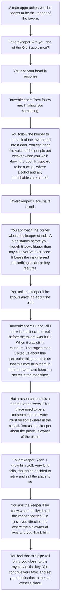

```mermaid
flowchart TD
  A[A man approaches you, he seems to be the keeper of the tavern.]
  A --> B[Tavernkeeper: Are you one of the Old Sage's men?]
  B --> C[You nod your head in response.]
  C --> D[Tavernkeeper: Then follow me, I'll show you something.]
  D --> E[You follow the keeper to the back of the tavern and into a door. You can hear the voice of the people get weaker when you walk down the door. It appears to be a cellar, where alcohol and any perishables are stored.]
  E --> F[Tavernkeeper: Here, have a look.]
  F --> G[You approach the corner where the keeper stands. A pipe stands before you, though it looks bigger than any pipe you've ever seen. It bears the insignia and the scribings that the key features.]
  G --> H[You ask the keeper if he knows anything about the pipe.]
  H --> I[Tavernkeeper: Dunno, all I know is that it existed well before the tavern was built. When it was still a museum. The sage's men visited us about this particular thing and told us that this may help them in their research and keep it a secret in the meantime.]
  I --> J[Not a research, but it is a search for answers. This place used to be a museum, so the owner must be somewhere in the capital. You ask the keeper about the previous owner of the place.]
  J --> K[Tavernkeeper: Yeah, I know him well. Very kind fella, though he decided to retire and sell the place to us.]
  K --> L[You ask the keeper if he knew where he lived and the keeper nodded. He gave you directions to where the old owner of lives and you thank him.]
  L --> M[You feel that this pipe will bring you closer to the mystery of the key. You continue your task, and set your destination to the old owner's place.]

```
