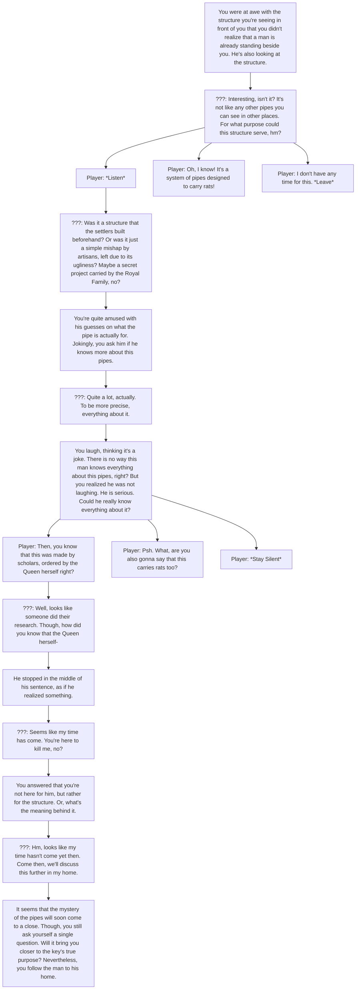

```mermaid
flowchart TD
  A[You were at awe with the structure you're seeing in front of you that you didn't realize that a man is already standing beside you. He's also looking at the structure.]
  A --> B[???: Interesting, isn't it? It's not like any other pipes you can see in other places. For what purpose could this structure serve, hm?]
  B --> C[Player: *Listen*]
  B --> D[Player: Oh, I know! It's a system of pipes designed to carry rats!]
  B --> E[Player: I don't have any time for this. *Leave*]

  C --> F[???: Was it a structure that the settlers built beforehand? Or was it just a simple mishap by artisans, left due to its ugliness? Maybe a secret project carried by the Royal Family, no?]
  F --> G[You're quite amused with his guesses on what the pipe is actually for. Jokingly, you ask him if he knows more about this pipes.]
  G --> H[???: Quite a lot, actually. To be more precise, everything about it.]
  H --> I[You laugh, thinking it's a joke. There is no way this man knows everything about this pipes, right? But you realized he was not laughing. He is serious. Could he really know everything about it?]

  I --> J[Player: Then, you know that this was made by scholars, ordered by the Queen herself right?]
  I --> K[Player: Psh. What, are you also gonna say that this carries rats too?]
  I --> L[Player: *Stay Silent*]

  J --> M[???: Well, looks like someone did their research. Though, how did you know that the Queen herself-]
  M --> N[He stopped in the middle of his sentence, as if he realized something.]
  N --> O[???: Seems like my time has come. You're here to kill me, no?]
  O --> P[You answered that you're not here for him, but rather for the structure. Or, what's the meaning behind it.]
  P --> Q[???: Hm, looks like my time hasn't come yet then. Come then, we'll discuss this further in my home.]
  Q --> R[It seems that the mystery of the pipes will soon come to a close. Though, you still ask yourself a single question. Will it bring you closer to the key's true purpose? Nevertheless, you follow the man to his home.]

```
