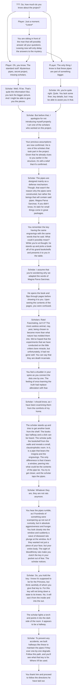

```mermaid
flowchart TD
  A[???: So, how much do you know about the project?]
  A --> B[PLayer: The only thing I know is that these pipes are part of something bigger.]
  A --> C[Player: Oh, you know. The standard stuff. Mysterious pipes, secret project, missing scholars.]
  A --> D[Player: Just a moment. *Leave*]

  D --> E[You are sitting in front of the man that will possibly answer all your questions. Leaving now will only delay the answers to the mystery.]
  E --> B & C

  C --> V[Scholar: Well, I'll be. That's quite the information! But, you lack the bigger picture. And I might be able to give you the pieces.]
  V --> W

  B --> F[Scholar: Ah, you're quite right. Quite. You lack some finer, key details, but I may be able to assist you in that.]
  F --> W[Scholar: But before that, I apologize for not introducing myself properly. I am one of the scholars who worked on this project.]
  W --> G[Your previous assumptions are now confirmed. He is one of the scholars that took part in the project. Given that he already clues to you earlier in the structure, it's still a relief that it's confirmed.]
  G --> H[Scholar: The pipes are designed mainly as a defense mechanism. Though, that wasn't the reason why the pipes were constructed, but rather the beings that will contain said pipes. Magna Parva Sarcinas. If you didn't know, it's latin for small things come in great packages.]
  H --> I[You remember the key having the same engravings with the same words that he said. What could it possibly mean? While you're at thought, he stands up and picks a book off of his grand bookshelfs and presents it to you in the table.]
  I --> J[Scholar: I assume that you're wondering why we adapted the words of Magna Parva Sarcinas.]
  J --> K[He opens the book and flips through pages before showing it to you. Upon seeing the contents of the pages, you were confused.]
  K --> L[Scholars: Rats! Fascinating, isn't it? The most useless animal, nay, pest, being chosen to become more than what nature has molded them into. We've hoped that the experiments that we have conducted on the little critters bore miracle, but unfortunately, it had not gone well. You can say that they are death incarnate.]
  L --> M[You feel a shudder in your spine as you connect the dots one by one. The feeling of once learning the truth had replace alleviation with fear.]
  M --> N[Scholar: I should know, as I have been examining them from the comforts of my home.]
  N --> O[The scholar stands up and tries to get another book from the shelf. The books tips halfway and a click can be heard. The scholar pulls the bookshelf from the walls and reveals a small, claustrophobic room. In it, is a pipe that bears the insignia and the engravings. The only differenece is that it bears a window, peering into what could be the contents of the pipe be. You try to get closer, and the scholar taps the pipes.]
  O --> P[Scholar: Whatever they are, they are not rats anymore.]
  P --> Q[You hear the pipes rumble, as if hundreds of something were scampering up not out of curiosity, but in absolute aggresiveness and hunger. You look closely into the window and suddenly a wave of diseased rats plunge at the window. As if they wanted not just a piece of your face, but your entire body. The sight of bloodthirsty rats make you clutch the key in your pocket out of fear. The scholar notices.]
  Q --> R[Scholar: So, you hold the key. I know it's supposed to be for the Princess, but think carefully of whom you give that key to. For this key will not bring down a state to its knees. No, it will eat it from the inside and into the out.]
  R --> S[The scholar lights a torch and points it into the dark side of the room. It appears to be a hallway.]
  S --> T[Scholar: To prevent any accidents, we built hallways like these to maintain the pipes if they ever one-by-one degrade. Follow this path, and you'll see what that key is for. Where it'll be used.]
  T --> U[You thank him and proceed to follow the directions he have laid out.]

```
